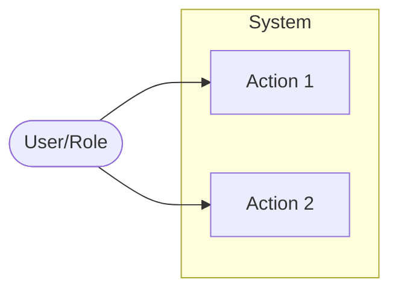
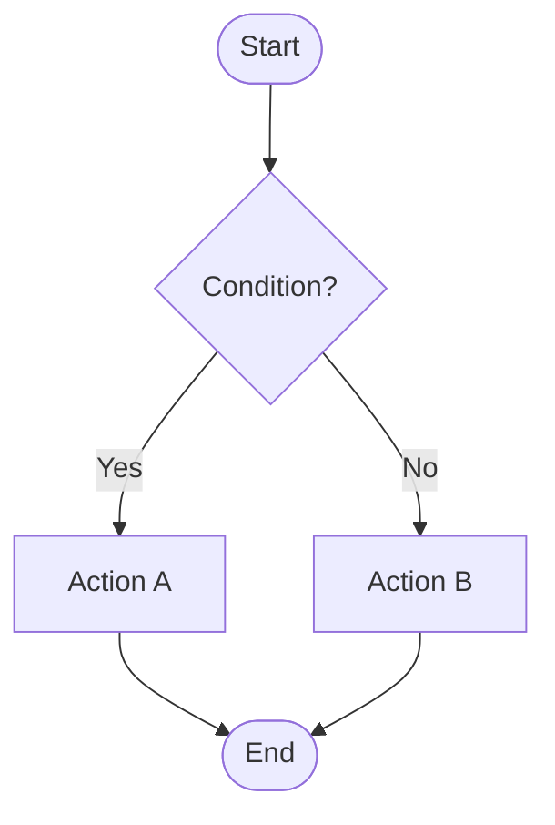
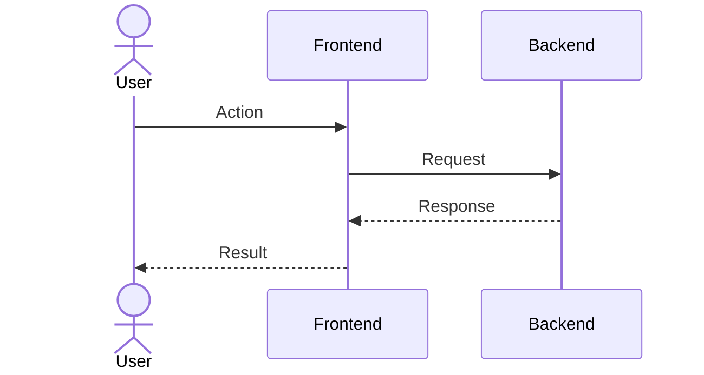
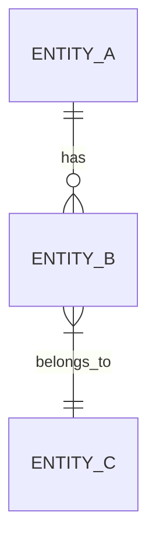
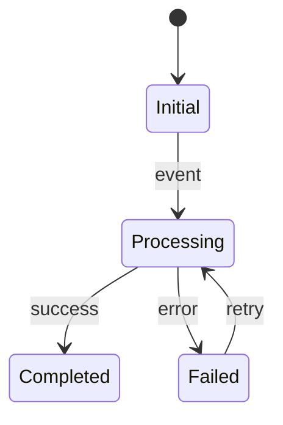

# Diagram Guide

Examples of each Mermaid diagram type for requirements.

## Use Case

## Flowchart

## Sequence

## Conceptual ER

## State Machine

## Rules
- Use Case: ALWAYS include. Defines scope visually.
- Flowchart: if REQs have IF/ELSE logic, validation, or multi-step calculation.
- Sequence: if ≥2 components interact (frontend→backend, service→service).
- Conceptual ER: if data is persisted (DB, files, state). NO column details — that's design.
- State Machine: if entity has lifecycle states (orders, tickets, processes).
