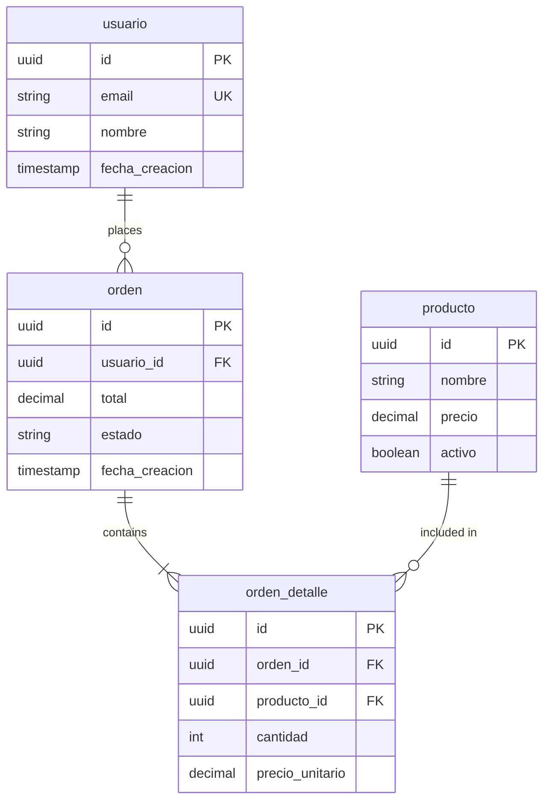

<!-- ⚠️ TEMPLATE — Este archivo fue generado por sdd-sync.sh. Llénalo con la información de tu proyecto. -->
<!-- Los powers (solution-designer, project-scanner, db-migrator) lo actualizan automáticamente. -->
# Data Model

> 📋 **TEMPLATE** — Reemplaza los placeholders con la información real de tu proyecto. Los powers lo actualizan automáticamente cuando features modifican la arquitectura.

## Entity Relationship Diagram

## Entities
<!-- Una sección por tabla/entidad -->

### usuario
| Column | Type | Nullable | Default | Index | Description |
|--------|------|----------|---------|-------|-------------|
| id | `uuid` | NO | `gen_random_uuid()` | PK | Identificador único del usuario |
| email | `varchar(255)` | NO | — | UNIQUE | Email del usuario, usado para login |
| nombre | `varchar(150)` | NO | — | — | Nombre completo |
| password_hash | `varchar(255)` | NO | — | — | Hash bcrypt del password |
| rol | `varchar(20)` | NO | `'user'` | IDX | Rol: `admin`, `user`, `guest` |
| activo | `boolean` | NO | `true` | — | Soft delete flag |
| fecha_creacion | `timestamptz` | NO | `now()` | IDX | Creation timestamp |
| fecha_actualizacion | `timestamptz` | NO | `now()` | — | Última actualización (trigger) |

### [Entity Name]
| Column | Type | Nullable | Default | Index | Description |
|--------|------|----------|---------|-------|-------------|
<!-- Agrega las columnas de la entidad -->

## Relationships
| From | To | Type | FK | ON DELETE |
|------|-----|------|------|-----------| 
| orden | usuario | Many-to-One | `orden.usuario_id → usuario.id` | CASCADE |
| orden_detalle | orden | Many-to-One | `orden_detalle.orden_id → orden.id` | CASCADE |
| orden_detalle | producto | Many-to-One | `orden_detalle.producto_id → producto.id` | RESTRICT |

## Migraciones
- **Convención de nombres**: `YYYYMMDDHHMMSS_description.sql` (ejemplo: `20260101120000_create_users_table.sql`)
- **Herramienta**: Prisma Migrate / Knex / TypeORM (seleccionar según el proyecto)
- **Reglas**:
  - Cada migración debe ser idempotente y reversible (`up` / `down`).
  - No modificar migraciones ya aplicadas en `cert` o `prod`.
  - Incluir índices y constraints en la misma migración que crea la tabla.
  - Migraciones de datos separadas de migraciones de esquema.
- **Ejecución**:
  - DEV: `npm run migrate:dev` (auto-apply)
  - CERT/PROD: `npm run migrate:deploy` (requires approval)

## Seeds
- Utilizar el power `test-data-generator` para generar datos de prueba consistentes.
- Archivo de seeds: `prisma/seed.ts` o `seeds/` directory.
- **Entornos**:
  - DEV: seeds completos con datos de prueba variados.
  - CERT: subset representativo con datos anonimizados.
  - PROD: solo datos de referencia (catálogos, roles, configuración).

## Changelog
| Date | Feature | Change |
|------|---------|--------|

---
_Last updated: [date] by [feature]_
