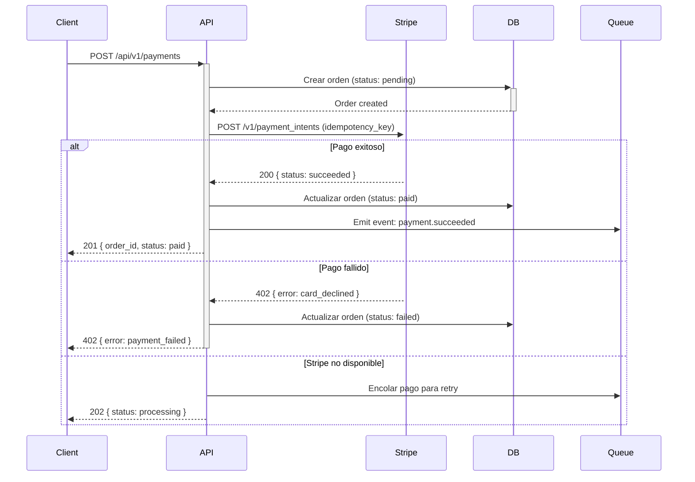

<!-- ⚠️ TEMPLATE — Este archivo fue generado por sdd-sync.sh. Llénalo con la información de tu proyecto. -->
<!-- Los powers (solution-designer, project-scanner, db-migrator) lo actualizan automáticamente. -->
# External Integrations

> 📋 **TEMPLATE** — Reemplaza los placeholders con la información real de tu proyecto. Los powers lo actualizan automáticamente cuando features modifican la arquitectura.

## Active Integrations
| Service | Purpose | Protocol | Auth | Environment Config |
|---------|---------|----------|------|--------------------|
| Stripe | Procesamiento de pagos | HTTPS REST | API Key (Bearer) | `/app/{env}/stripe-secret-key` |
| SendGrid | Email transaccional | HTTPS REST | API Key | `/app/{env}/sendgrid-api-key` |
| Firebase FCM | Push notifications | HTTPS REST | Service Account JSON | `/app/{env}/fcm-credentials` |

## Platform Integrations
<!-- Llenado por: solution-designer (step 13) o project-scanner (CP1). -->\n<!-- Requerido: solo si deployment.app incluye Vercel. Omitir sección completa si no aplica. -->

### Vercel (si `deployment.app` incluye Vercel)
| Aspecto | Detalle |
|---------|---------|
| **Tipo** | Git integration directa (auto-deploy) |
| **Setup** | One-time: conectar repo en Vercel Dashboard |
| **Preview** | Auto per PR → `{branch}-{project}.vercel.app` |
| **Staging** | Auto on merge a `dev` → `dev-{project}.vercel.app` |
| **Production** | Auto on merge a `main` → dominio custom |
| **Rollback** | `vercel rollback` o re-deploy desde dashboard |

> No requiere tokens en CI/CD — Vercel usa Git webhooks directamente.

#### Environment Variables
| Variable | Scope | Dónde configurar |
|----------|-------|-----------------|
| `DATABASE_URL` | Production, Preview, Development | Vercel Dashboard → Settings → Env Vars |
| `API_URL` | Production, Preview | Vercel Dashboard (usar `@secret-name` en `vercel.json`) |
| Secrets | Production only | Vercel Dashboard → never in `vercel.json` |

> Sync: si se agrega env var en AWS (SSM/Secrets Manager), agregar equivalente en Vercel Dashboard.

#### Troubleshooting
| Síntoma | Causa probable | Solución |
|---------|---------------|----------|
| Preview no se genera | Webhook desconectado | Vercel Dashboard → Git → reconectar |
| Build falla | Dependencia faltante | Revisar `buildCommand` en `vercel.json` |
| 404 en rutas | Rewrites mal configurados | Verificar `rewrites` en `vercel.json` |
| Env var undefined | Scope incorrecto | Verificar que esté en Preview + Production |

## Integration Details
<!-- Una sección por servicio externo -->

### Stripe — Procesamiento de Pagos
- **URL**: `https://api.stripe.com/v1`
- **Auth**: API Key (Bearer `sk_live_...`)
- **Rate limits**: 100 req/sec
- **Retry**: exponential backoff, max 3, idempotency key
- **Circuit breaker**: open after 5 failures in 30s, half-open after 60s
- **Fallback**: queue payment for retry, notify user
- **SSM Parameter**: `/app/{env}/stripe-secret-key`
- **Health check**: `GET /v1/balance` (200 = healthy)

### Flujo de Pago

### [Service Name]
- **URL**: `https://api.service.com`
- **Auth**: API Key / OAuth2 / etc.
- **Rate limits**: X req/min
- **Retry strategy**: exponential backoff, max 3
- **Fallback**: queue for retry / return cached / fail gracefully
- **SSM Parameter**: `/app/{env}/service-api-key`

## Circuit Breaker Pattern
Patrón implementado para todas las integraciones externas:

| Estado | Descripción | Transición |
|--------|-------------|------------|
| **Closed** | Operación normal. Requests pasan al servicio externo. | → Open: cuando fallan ≥ 5 requests en 30s |
| **Open** | Circuito abierto. Requests retornan fallback inmediatamente sin llamar al servicio. | → Half-Open: después de 60s de cooldown |
| **Half-Open** | Prueba de recuperación. Se permite 1 request de prueba. | → Closed: si el request de prueba es exitoso |
|  |  | → Open: si el request de prueba falla |

Configuración por defecto (ajustar por integración):
- `failureThreshold`: 5
- `failureWindow`: 30s
- `cooldownPeriod`: 60s
- `successThreshold`: 1 (requests exitosos en half-open para cerrar)

## Health Checks
| Integración | Método de verificación | Intervalo | Timeout | Acción en fallo |
|-------------|----------------------|-----------|---------|-----------------|
| Stripe | `GET /v1/balance` → 200 | 60s | 5s | Alert + circuit breaker |
| SendGrid | `GET /v3/scopes` → 200 | 120s | 5s | Alert + queue emails |
| Firebase FCM | Token validation request | 300s | 10s | Alert + skip push |

## Changelog
| Date | Feature | Change |
|------|---------|--------|

---
_Last updated: [date] by [feature]_
