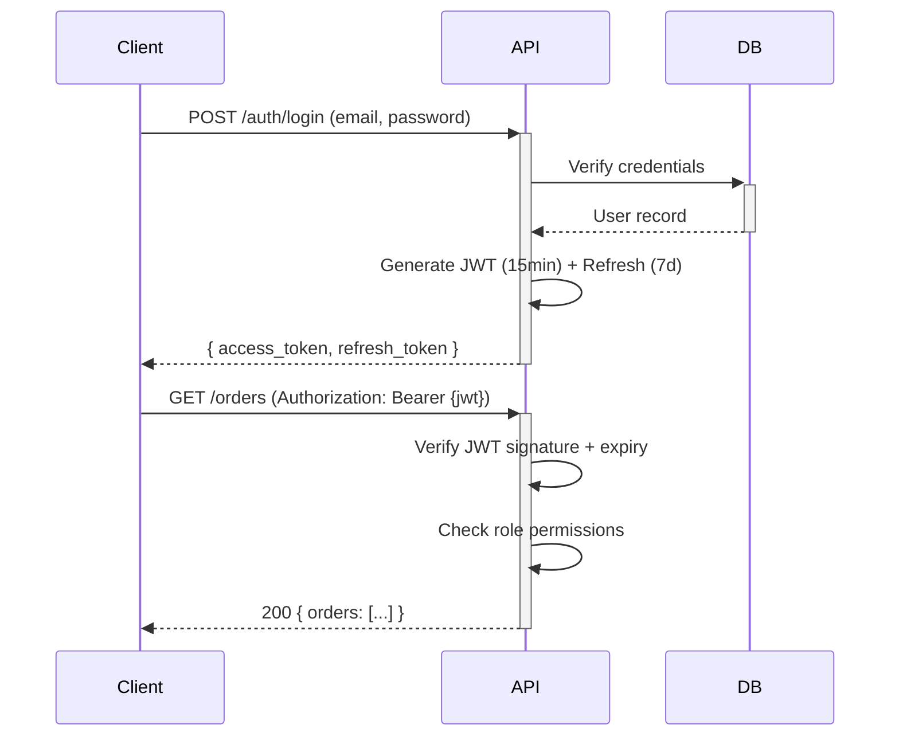

<!-- ⚠️ TEMPLATE — Este archivo fue generado por sdd-sync.sh. Llénalo con la información de tu proyecto. -->
<!-- Los powers (solution-designer, project-scanner, db-migrator) lo actualizan automáticamente. -->
# Security Model

> 📋 **TEMPLATE** — Reemplaza los placeholders con la información real de tu proyecto. Los powers lo actualizan automáticamente cuando features modifican la arquitectura.

## Authentication
| Method | Provider | Details |
|--------|----------|---------|
| JWT (RS256) | Custom Auth Service | Access token 15 min, Refresh token 7 días |
| API Key | API Gateway | Para integraciones service-to-service |

### JWT Flow

## Authorization
### Roles
| Role | Description | Permisos principales |
|------|-------------|---------------------|
| `admin` | Administrador del sistema | CRUD completo en todos los recursos, gestión de usuarios |
| `user` | Usuario autenticado | CRUD sobre sus propios recursos, lectura de catálogos |
| `guest` | Acceso público limitado | Solo lectura de endpoints públicos (productos, info) |

### Permission Matrix
| Resource | Admin | User | Guest |
|----------|-------|------|-------|
| `GET /users` | ✅ | ❌ | ❌ |
| `GET /users/:id` | ✅ | ✅ (own) | ❌ |
| `PUT /users/:id` | ✅ | ✅ (own) | ❌ |
| `GET /orders` | ✅ (all) | ✅ (own) | ❌ |
| `POST /orders` | ✅ | ✅ | ❌ |
| `DELETE /orders/:id` | ✅ | ❌ | ❌ |
| `GET /products` | ✅ | ✅ | ✅ |
| `POST /products` | ✅ | ❌ | ❌ |

## Secrets Management
| Secret | Storage | Path |
|--------|---------|------|
| DB credentials | AWS Secrets Manager | `/app/{env}/db-credentials` |
| API keys | SSM Parameter Store | `/app/{env}/api-key` |
| JWT signing key (RSA) | AWS Secrets Manager | `/app/{env}/jwt-private-key` |
| Stripe secret key | SSM Parameter Store | `/app/{env}/stripe-secret-key` |

## CORS
| Environment | Allowed Origins | Credentials | Max Age |
|-------------|----------------|-------------|---------|
| DEV | `http://localhost:3000`, `http://localhost:5173` | `true` | 3600 |
| CERT | `https://cert.example.com` | `true` | 3600 |
| PROD | `https://app.example.com` | `true` | 86400 |

Métodos permitidos: `GET, POST, PUT, PATCH, DELETE, OPTIONS`
Headers permitidos: `Content-Type, Authorization, X-Request-ID`

## Audit Log
Registro de auditoría para acciones sensibles:

| Evento | Datos registrados | Retención |
|--------|------------------|-----------|
| Login exitoso/fallido | `userId`, `ip`, `userAgent`, `timestamp` | 90 días |
| Cambio de password | `userId`, `ip`, `timestamp` | 1 año |
| Cambio de rol | `userId`, `targetUserId`, `oldRole`, `newRole` | 1 año |
| Acceso a datos sensibles | `userId`, `resource`, `action`, `ip` | 1 año |
| Creación/eliminación de recursos | `userId`, `resourceType`, `resourceId`, `action` | 90 días |

**Formato**: JSON structured logs → CloudWatch Logs → S3 (long-term).
**Inmutabilidad**: Los logs se almacenan en S3 con Object Lock (WORM) para cumplimiento.

## OWASP Top 10 Checklist
| # | Vulnerabilidad | Estado | Mitigación |
|---|---------------|--------|------------|
| A01 | Broken Access Control | - [ ] | RBAC en middleware, validación de ownership |
| A02 | Cryptographic Failures | - [ ] | TLS 1.3, bcrypt para passwords, RS256 para JWT |
| A03 | Injection | - [ ] | Queries parametrizadas (ORM), input validation con Zod |
| A04 | Insecure Design | - [ ] | Threat modeling por feature, security review en PR |
| A05 | Security Misconfiguration | - [ ] | Helmet.js, CORS restrictivo, headers de seguridad |
| A06 | Vulnerable Components | - [ ] | `npm audit` en CI, Dependabot habilitado |
| A07 | Auth Failures | - [ ] | Rate limiting en login, account lockout tras 5 intentos |
| A08 | Software & Data Integrity | - [ ] | Checksums en CI/CD, signed commits, lockfile check |
| A09 | Logging & Monitoring Failures | - [ ] | Structured logging, alertas en errores 5xx, audit log |
| A10 | Server-Side Request Forgery | - [ ] | Whitelist de URLs externas, validación de inputs URL |

## Security Checklist
- [ ] All endpoints require authentication (except public)
- [ ] CORS configured per environment
- [ ] Rate limiting enabled
- [ ] Input validation on all endpoints
- [ ] SQL injection prevention (parameterized queries)
- [ ] XSS prevention (output encoding)

## Changelog
| Date | Feature | Change |
|------|---------|--------|

---
_Last updated: [date] by [feature]_
