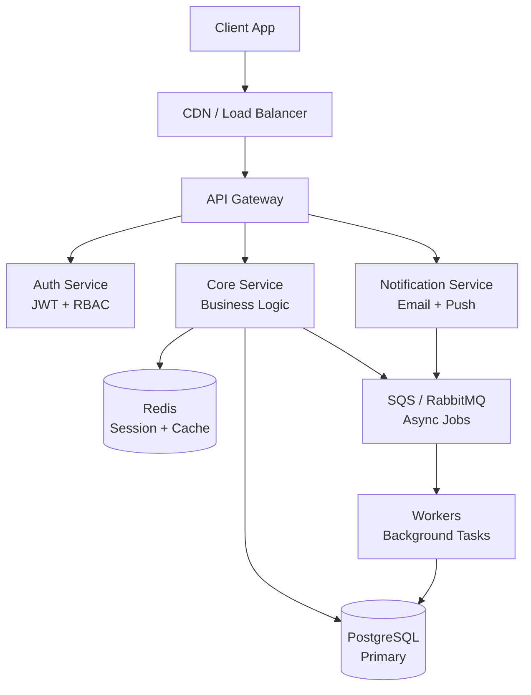

<!-- ⚠️ TEMPLATE — Este archivo fue generado por sdd-sync.sh. Llénalo con la información de tu proyecto. -->
<!-- Los powers (solution-designer, project-scanner, db-migrator) lo actualizan automáticamente. -->
# System Design

> 📋 **TEMPLATE** — Reemplaza los placeholders con la información real de tu proyecto. Los powers lo actualizan automáticamente cuando features modifican la arquitectura.

## Overview
<!-- Descripción breve del sistema: propósito, usuarios principales, volumen esperado -->

## Architecture Diagram
<!-- Mermaid diagram of main components and their interactions -->

## Components
| Component | Technology | Purpose | Owner |
|-----------|-----------|---------|-------|
| API Gateway | Express + Node.js 20 | Routing, auth middleware, rate limiting | Backend |
| Auth Service | Passport.js + JWT | Autenticación y autorización RBAC | Backend |
| Core Service | NestJS | Lógica de negocio y orquestación | Backend |
| Notification Service | Nodemailer + Firebase FCM | Envío de emails transaccionales y push notifications | Backend |
| Workers | Bull + Redis | Procesamiento asíncrono de jobs en background | Platform |
<!-- Agrega componentes adicionales según el proyecto -->

## Infrastructure
<!-- Llenado por: solution-designer (step 13). Actualizado cuando infra cambia. -->
<!-- Recursos cloud según deployment.pattern en .sdd-config.json -->

### Si `deployment.app` incluye Vercel (fullstack-vercel / monorepo-split / frontend-only)
<!-- Omitir si backend-only o si el proyecto NO usa Vercel. -->
| Resource | Service | Environment | Notes |
|----------|---------|-------------|-------|
| Frontend | Vercel (Git integration) | Preview / Staging / Prod | Auto-deploy per PR, staging en `dev`, prod en `main` |
| Custom Domain | Vercel Domains | prod | `app.example.com` |

### Infra AWS (siempre presente como `deployment.infra`)
| Resource | Service | Environment | Notes |
|----------|---------|-------------|-------|
| Database | RDS PostgreSQL 15 | dev / cert / prod | Multi-AZ en prod |
| Cache | ElastiCache Redis 7 | dev / cert / prod | Cluster mode en prod |
| Queue | Amazon SQS | dev / cert / prod | FIFO queues para jobs críticos |
| Storage | S3 | dev / cert / prod | Versionado habilitado en prod |
| CDN | CloudFront | cert / prod | Solo si NO usa Vercel para frontend |

## Ambientes
| Aspecto | DEV | CERT | PROD |
|---------|-----|------|------|
| Instancias API | 1 × t3.small | 2 × t3.medium | 4 × c6g.large (ASG) |
| Base de datos | db.t3.micro, single-AZ | db.t3.small, single-AZ | db.r6g.large, Multi-AZ |
| Redis | 1 nodo, sin persistencia | 1 nodo, AOF | Cluster 3 nodos, AOF |
| Dominio | `dev-api.example.com` | `cert-api.example.com` | `api.example.com` |
| Logs level | DEBUG | INFO | WARN |
| Datos | Seeds de prueba | Subset anonimizado de prod | Datos reales |

## Escalabilidad
- **Horizontal**: Auto Scaling Group (ASG) para API y Workers. Escala entre 2–8 instancias basado en CPU > 70% o queue depth > 100.
- **Vertical**: Base de datos puede escalar verticalmente durante ventanas de mantenimiento planificadas.
- **Cuellos de botella conocidos**:
  - Escrituras a PostgreSQL en órdenes con alta concurrencia → mitigar con optimistic locking + batch inserts.
  - Redis como single point of failure en dev/cert → cluster mode en prod.
  - Procesamiento de notificaciones → rate limiting hacia proveedores externos (SES, FCM).

## Observabilidad
| Tipo | Herramienta | Detalle |
|------|------------|---------|
| Logs | CloudWatch Logs + structured JSON | `correlationId` en cada request, retención 30d dev / 90d prod |
| Métricas | CloudWatch Metrics + custom dashboards | Latencia p50/p95/p99, error rate, queue depth, cache hit ratio |
| Alertas | CloudWatch Alarms → SNS → PagerDuty | Error rate > 5% (warning), > 10% (critical); latencia p99 > 2s |
| Tracing | AWS X-Ray | Tracing distribuido end-to-end, sampling 10% en prod |
| Health checks | `/health` endpoint en cada servicio | Checks: DB connection, Redis ping, queue accessibility |

## Key Decisions
<!-- Enlaza a ADRs si existen: docs/architecture/adr/ -->

---
_Last updated: [date] by [feature]_
