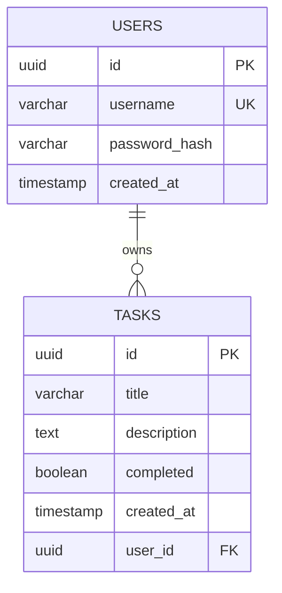

# Data Model — Task Manager SDD

> 📋 Generated by `solution-designer` · 2026-07-08
> Source: [design.md](../../specs/AB%23104567-task-manager-core/design.md) §Database Schema

## Entity Relationship

## Tables

### users
| Column | Type | Constraints | Default | Description |
|---|---|---|---|---|
| id | UUID | PK | `gen_random_uuid()` | Identificador único |
| username | VARCHAR(50) | UNIQUE, NOT NULL | — | Nombre de usuario |
| password_hash | VARCHAR(255) | NOT NULL | — | Hash bcrypt del password |
| created_at | TIMESTAMP | NOT NULL | `NOW()` | Fecha de creación |

### tasks
| Column | Type | Constraints | Default | Description |
|---|---|---|---|---|
| id | UUID | PK | `gen_random_uuid()` | Identificador único |
| title | VARCHAR(255) | NOT NULL | — | Título de la tarea |
| description | TEXT | NULLABLE | `NULL` | Descripción opcional |
| completed | BOOLEAN | NOT NULL | `false` | Estado de completitud |
| created_at | TIMESTAMP | NOT NULL | `NOW()` | Fecha de creación |
| user_id | UUID | FK → users(id), NOT NULL, ON DELETE CASCADE | — | Propietario de la tarea |

## Indexes
| Name | Table | Columns | Type | Purpose |
|---|---|---|---|---|
| users_pkey | users | id | PK | Primary key |
| idx_users_username | users | username | UNIQUE | Login lookup |
| tasks_pkey | tasks | id | PK | Primary key |
| idx_tasks_user_id | tasks | user_id | B-tree | Filtrar tareas por usuario |
| idx_tasks_created_at | tasks | created_at DESC | B-tree | Orden cronológico (REQ-002) |

## Relationships
| FK | From | To | On Delete |
|---|---|---|---|
| fk_tasks_user_id | tasks.user_id | users.id | CASCADE |

## Seed Data
| Table | Data | Purpose |
|---|---|---|
| users | `{ username: "admin", password_hash: bcrypt("adminpassword", cost: 12) }` | Administrador preconfigurado para pruebas y login del MVP. |
| users | `4 usuarios aleatorios (Faker.js, password: "password123")` | Cuentas secundarias para pruebas de concurrencia y aislamiento. |
| tasks | `8 tareas del usuario admin (Faker.js: hacker titles, lorem, boolean status, recent dates)` | Tareas precargadas para visualización del administrador en la lista. |
| tasks | `3 a 6 tareas por usuario aleatorio (Faker.js)` | Datos de prueba para simulación de base de datos poblada. |
