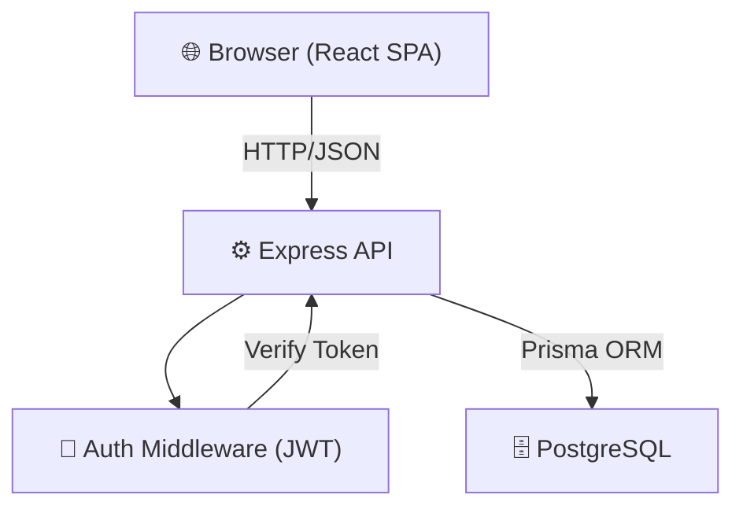
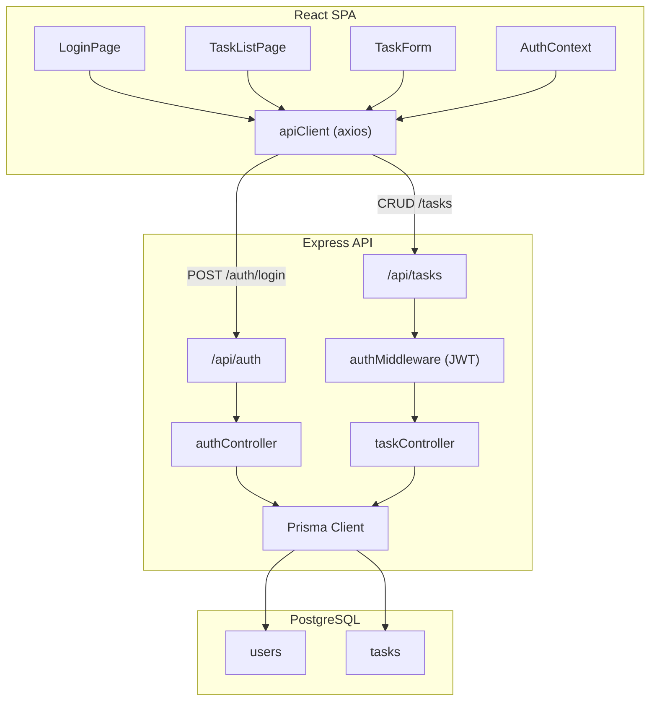
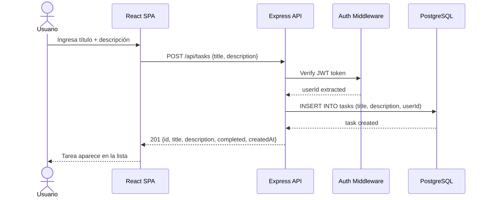
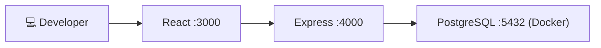
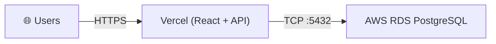

# Design: Task Manager Core

> 📋 Generated by `solution-designer` · 2026-07-08
> ✅ Approved by: jsolano (2026-07-08)

## Traceability
- **Work Item**: [AB#104568](https://dev.azure.com/unipagosa/SDD_SANDBOX/_workitems/edit/104568)
- **Parent**: [AB#104567](https://dev.azure.com/unipagosa/SDD_SANDBOX/_workitems/edit/104567)
- **Branch**: `feature/AB#104567-task-manager-core`
- **Requirements**: [requirements.md](./requirements.md)
- **Test Plan**: [test-plan.md](./test-plan.md)

## Technology Decisions
- **Frontend**: React 18 — SPA ligera, componentes reutilizables, ecosistema maduro para formularios e interacciones
- **Backend**: Node.js 20 + Express 5 — API REST minimalista, mismo lenguaje que frontend (TypeScript), rápido para MVP
- **Database**: PostgreSQL 16 — relacional, modelo User→Task con FK, robusto, free tier en RDS
- **ORM**: Prisma — type-safe, migraciones automáticas, integración nativa con PostgreSQL
- **Auth**: JWT (jsonwebtoken) + bcrypt + API Key gate — stateless, hash seguro, gate global con `x-api-key` header
- **Cloud Services**: AWS RDS (PostgreSQL), Vercel (hosting app)
- **Theme**: `corporate` — herramienta de productividad/gestión interna

### Descartados
| Tecnología | Razón de descarte |
|---|---|
| MongoDB | Modelo relacional simple (User→Task), SQL más natural |
| Next.js | SSR no aporta valor para SPA To-Do |
| Firebase | Vendor lock-in innecesario |
| Passport.js | Overhead para auth simple con un solo tipo de usuario |
| Aurora | Overkill y costo excesivo para MVP |

## Architecture

### System Overview


### Component Diagram


### Sequence Diagram — Crear tarea


## Deployment
- **Pattern**: `fullstack-vercel`
- **App**: Vercel — React frontend + Express API (serverless functions)
- **Infra**: AWS — RDS PostgreSQL 16 (db.t3.micro free tier)
- **CI/CD**: Vercel auto-deploy desde GitHub (preview en PR, prod en main)
- **Justification**: Un solo deploy para frontend + API, zero-config, SSL automático
- **Discarded**: AWS ECS (overhead de contenedores para MVP), Heroku (costos sin free tier)

### Environments
| Environment | URL | Deploy trigger |
|---|---|---|
| Dev | `localhost:3000` (React) + `localhost:4000` (API) | Manual |
| Preview | `pr-N.vercel.app` | Push a PR |
| Production | `task-manager.vercel.app` | Merge a main |

## Database Schema

### Table: users
| Column | Type | Constraints | Default | Description |
|---|---|---|---|---|
| id | UUID | PK | `gen_random_uuid()` | Identificador único |
| username | VARCHAR(50) | UNIQUE, NOT NULL | — | Nombre de usuario |
| password_hash | VARCHAR(255) | NOT NULL | — | Hash bcrypt del password |
| created_at | TIMESTAMP | NOT NULL | `NOW()` | Fecha de creación |

### Table: tasks
| Column | Type | Constraints | Default | Description |
|---|---|---|---|---|
| id | UUID | PK | `gen_random_uuid()` | Identificador único |
| title | VARCHAR(255) | NOT NULL | — | Título de la tarea |
| description | TEXT | NULLABLE | `NULL` | Descripción opcional |
| completed | BOOLEAN | NOT NULL | `false` | Estado de completitud |
| created_at | TIMESTAMP | NOT NULL | `NOW()` | Fecha de creación |
| user_id | UUID | FK → users(id), NOT NULL | — | Propietario de la tarea |

### Indexes
| Name | Columns | Type |
|---|---|---|
| idx_tasks_user_id | tasks.user_id | B-tree |
| idx_tasks_created_at | tasks.created_at DESC | B-tree |
| idx_users_username | users.username | UNIQUE |

## API Contracts

### POST /api/auth/login
- **Request**:
  ```json
  { "username": "string", "password": "string" }
  ```
- **Response** (200):
  ```json
  { "token": "jwt_string", "user": { "id": "uuid", "username": "string" } }
  ```
- **Auth**: API key requerida, JWT no requerido
- **Headers**: `x-api-key: {API_KEY}`
- **Errors**: `401 Credenciales inválidas`
- **Maps to**: REQ-005
- **curl**:
  ```bash
  curl -X POST http://localhost:4000/api/auth/login \
    -H "Content-Type: application/json" \
    -d '{"username":"admin","password":"password123"}'
  ```

---

### GET /api/tasks
- **Request**: Headers: `Authorization: Bearer {token}`
- **Response** (200):
  ```json
  {
    "tasks": [
      { "id": "uuid", "title": "string", "description": "string|null", "completed": false, "createdAt": "ISO8601" }
    ]
  }
  ```
- **Auth**: JWT requerido
- **Errors**: `401 No autenticado`
- **Maps to**: REQ-002
- **curl**:
  ```bash
  curl http://localhost:4000/api/tasks \
    -H "Authorization: Bearer {token}"
  ```

---

### POST /api/tasks
- **Request**:
  ```json
  { "title": "string", "description": "string (optional)" }
  ```
- **Response** (201):
  ```json
  { "id": "uuid", "title": "string", "description": "string|null", "completed": false, "createdAt": "ISO8601" }
  ```
- **Auth**: JWT requerido
- **Errors**: `400 Título es requerido`, `401 No autenticado`
- **Validation**: title no vacío, trim whitespace
- **Maps to**: REQ-001
- **curl**:
  ```bash
  curl -X POST http://localhost:4000/api/tasks \
    -H "Authorization: Bearer {token}" \
    -H "Content-Type: application/json" \
    -d '{"title":"Comprar leche","description":"En el supermercado"}'
  ```

---

### PATCH /api/tasks/:id
- **Request**:
  ```json
  { "completed": true }
  ```
- **Response** (200):
  ```json
  { "id": "uuid", "title": "string", "description": "string|null", "completed": true, "createdAt": "ISO8601" }
  ```
- **Auth**: JWT requerido
- **Errors**: `404 Tarea no encontrada`, `401 No autenticado`, `403 No es tu tarea`
- **Maps to**: REQ-003
- **curl**:
  ```bash
  curl -X PATCH http://localhost:4000/api/tasks/{id} \
    -H "Authorization: Bearer {token}" \
    -H "Content-Type: application/json" \
    -d '{"completed":true}'
  ```

---

### DELETE /api/tasks/:id
- **Request**: Headers: `Authorization: Bearer {token}`
- **Response** (204): No content
- **Auth**: JWT requerido
- **Errors**: `404 Tarea no encontrada`, `401 No autenticado`, `403 No es tu tarea`
- **Maps to**: REQ-004
- **curl**:
  ```bash
  curl -X DELETE http://localhost:4000/api/tasks/{id} \
    -H "Authorization: Bearer {token}"
  ```

## Infrastructure

### Dev (Docker Compose)


### Production


## Supporting Considerations

### Technical Assumptions
| # | Asunción | Impacto |
|---|---|---|
| T1 | TypeScript en frontend y backend | Type safety end-to-end |
| T2 | Prisma genera migraciones SQL | No SQL manual para schema changes |
| T3 | JWT sin refresh token (MVP) | Sesión expira, usuario re-login |
| T4 | Un solo usuario seed (no registro) | Script de seed en Wave 0 |
| T5 | CORS configurado para localhost:3000 → :4000 | Dev environment |

### Limitaciones
- Sin refresh tokens → la sesión expira y el usuario debe re-autenticarse
- Sin paginación → si el usuario tiene 1000+ tareas, performance puede degradar
- Sin rate limiting → vulnerable a brute force en login (aceptable para MVP)
- Sin WebSocket → la lista no se actualiza en tiempo real entre tabs

### Infrastructure Dependencies
- Docker Desktop (dev) — ya instalado ✅
- AWS Account con acceso a RDS (prod) — verificado ✅
- Vercel account para deploy — pendiente configurar
- GitHub repo para CI/CD — ya existe ✅

## Architecture Updates
- `docs/architecture/data-model.md`: Agregar tablas `users`, `tasks`
- `docs/architecture/api-contract.md`: Agregar 5 endpoints REST
- `docs/architecture/system-design.md`: Diagrama React → Express → RDS
- `docs/architecture/security-model.md`: JWT auth + bcrypt hashing

## Requirements Coverage
| REQ | Cubierto por | Status |
|---|---|---|
| REQ-001 | §API `POST /api/tasks` + §DB `tasks` table + §Validation (título no vacío) | ✅ |
| REQ-002 | §API `GET /api/tasks` + §DB `idx_tasks_created_at` (orden DESC) | ✅ |
| REQ-003 | §API `PATCH /api/tasks/:id` + §DB `completed` boolean toggle | ✅ |
| REQ-004 | §API `DELETE /api/tasks/:id` + confirmación en frontend | ✅ |
| REQ-005 | §API `POST /api/auth/login` + §Auth JWT middleware + §DB `users` table | ✅ |

## Approval
- [x] Developer: jsolano Date: 2026-07-08

---
> 📍 [AB#104568](https://dev.azure.com/unipagosa/SDD_SANDBOX/_workitems/edit/104568) · 🌿 `feature/AB#104567-task-manager-core` · Generated by SDD Standard
