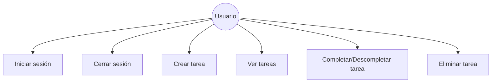
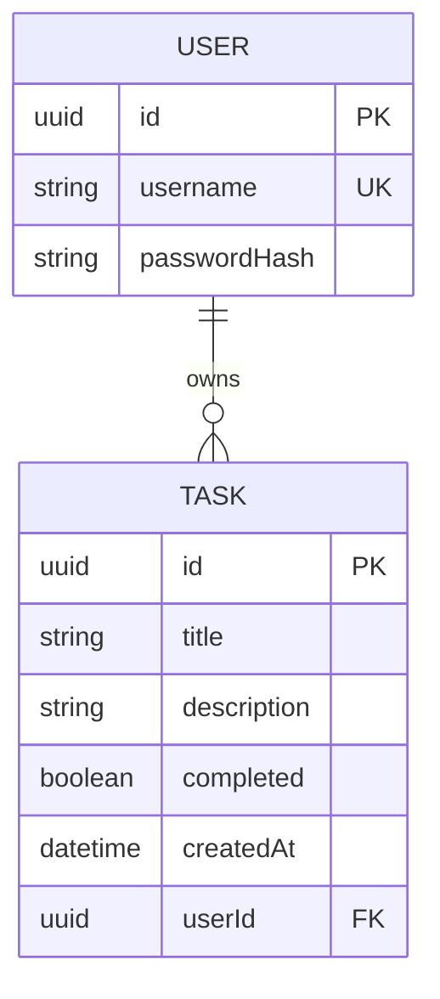
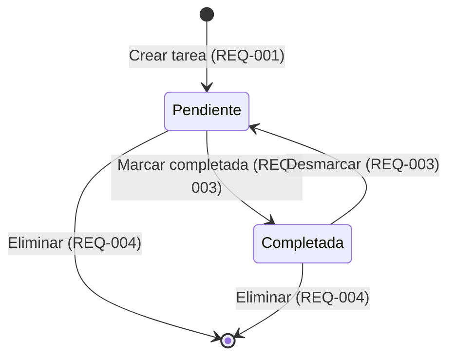

# Requirements: Task Manager Core

> 📋 Generated by `requirements-analyst` · 2026-07-08
> ✅ Approved by: jsolano (2026-07-08)

## Traceability
- **Work Item**: [AB#104568](https://dev.azure.com/unipagosa/SDD_SANDBOX/_workitems/edit/104568)
- **Parent**: [AB#104567](https://dev.azure.com/unipagosa/SDD_SANDBOX/_workitems/edit/104567)
- **Branch**: `feature/AB#104567-task-manager-core`
- **Design**: [design.md](./design.md)
- **Test Plan**: [test-plan.md](./test-plan.md)

## Overview

Aplicación sencilla de gestión de tareas (To-Do App) con autenticación básica. Permite a un usuario autenticado crear, visualizar, completar y eliminar tareas personales. MVP enfocado en las operaciones CRUD esenciales con seguridad mínima.

## User Stories (EARS Notation)

### REQ-001: Crear tarea
**Type:** Event-Driven
**Rule:** WHEN el usuario proporciona un título de tarea, the system SHALL crear una nueva tarea con estado "pendiente", la fecha de creación actual y una descripción opcional.
**Entities:** Task (id, title, description, completed, createdAt, userId)
**Error Handling:** IF el título está vacío o solo contiene espacios, the system SHALL rechazar la creación e informar al usuario.

**Acceptance Criteria:**
- [ ] Given el usuario ingresa título "Comprar leche" y descripción "En el supermercado del barrio", when envía el formulario, then la tarea aparece en la lista con ambos campos
- [ ] Given el usuario ingresa título sin descripción, when envía el formulario, then la tarea se crea con descripción vacía
- [ ] Given el usuario deja el título vacío, when intenta crear, then el sistema muestra un mensaje de error
- [ ] Given la tarea se crea exitosamente, then los campos de entrada se limpian

**Priority:** Must
**Dependencies:** REQ-005
**Tracker:** AB#104567

---

### REQ-002: Listar tareas
**Type:** Ubiquitous
**Rule:** The system SHALL mostrar todas las tareas del usuario autenticado, ordenadas por fecha de creación descendente (más recientes primero).
**Entities:** Task (id, title, description, completed, createdAt, userId)
**Error Handling:** IF no existen tareas, the system SHALL mostrar un mensaje indicando que no hay tareas registradas.

**Acceptance Criteria:**
- [ ] Given el usuario tiene 3 tareas, when accede a la lista, then ve las 3 tareas ordenadas de más reciente a más antigua
- [ ] Given el usuario no tiene tareas, when accede a la lista, then ve un mensaje "No hay tareas registradas"
- [ ] Given cada tarea en la lista, then muestra título, descripción (si existe) y estado (pendiente/completada)

**Priority:** Must
**Dependencies:** REQ-001, REQ-005
**Tracker:** AB#104567

---

### REQ-003: Completar/Descompletar tarea
**Type:** Event-Driven
**Rule:** WHEN el usuario selecciona una tarea, the system SHALL alternar su estado entre "pendiente" y "completada".
**Entities:** Task (completed)
**Error Handling:** IF la tarea no existe, the system SHALL informar que la tarea no fue encontrada.

**Acceptance Criteria:**
- [ ] Given una tarea pendiente, when el usuario la marca, then cambia a completada con indicador visual (tachado, check, etc.)
- [ ] Given una tarea completada, when el usuario la desmarca, then vuelve a estado pendiente
- [ ] Given la tarea cambia de estado, then la lista se actualiza inmediatamente sin recargar

**Priority:** Must
**Dependencies:** REQ-001, REQ-002
**Tracker:** AB#104567

---

### REQ-004: Eliminar tarea
**Type:** Event-Driven
**Rule:** WHEN el usuario solicita eliminar una tarea, the system SHALL pedir confirmación y, IF el usuario confirma, the system SHALL eliminar la tarea permanentemente.
**Entities:** Task
**Error Handling:** IF la tarea no existe, the system SHALL informar que la tarea no fue encontrada.

**Acceptance Criteria:**
- [ ] Given una tarea existente, when el usuario presiona eliminar, then el sistema muestra confirmación "¿Eliminar esta tarea?"
- [ ] Given el usuario confirma, then la tarea se elimina y desaparece de la lista
- [ ] Given el usuario cancela, then la tarea permanece sin cambios

**Priority:** Must
**Dependencies:** REQ-001, REQ-002
**Tracker:** AB#104567

---

### REQ-005: Autenticación básica
**Type:** Event-Driven
**Rule:** WHEN el usuario accede a la aplicación, the system SHALL solicitar credenciales (usuario y contraseña). IF las credenciales son válidas, the system SHALL otorgar acceso a las funcionalidades. IF las credenciales son inválidas, the system SHALL rechazar el acceso e informar al usuario.
**Entities:** User (id, username, passwordHash)
**Error Handling:** IF las credenciales son incorrectas, the system SHALL mostrar "Credenciales inválidas" sin revelar cuál campo es incorrecto.

**Acceptance Criteria:**
- [ ] Given credenciales válidas, when el usuario envía el formulario de login, then accede a la lista de tareas
- [ ] Given credenciales inválidas, when el usuario envía el formulario, then ve mensaje genérico de error
- [ ] Given el usuario no está autenticado, when intenta acceder a cualquier funcionalidad, then es redirigido al login
- [ ] Given el usuario está autenticado, when cierra sesión, then vuelve al formulario de login

**Priority:** Must
**Dependencies:** None
**Tracker:** AB#104567

## Non-Functional Requirements

### NFR-001: Hash de contraseñas
**Category:** Security
**Rule:** The system SHALL almacenar contraseñas con hash (bcrypt o equivalente), nunca en texto plano.
**Metric:** 0 contraseñas almacenadas sin hash
**Priority:** Must

### NFR-002: Responsive design
**Category:** Accessibility
**Rule:** The system SHALL ser usable en dispositivos móviles (≥320px) y desktop.
**Metric:** UI funcional en viewports de 320px a 1920px
**Priority:** Must

### NFR-003: Rendimiento
**Category:** Performance
**Rule:** The system SHALL responder a cualquier acción del usuario en menos de 500ms.
**Metric:** Tiempo de respuesta < 500ms p95
**Priority:** Should

### NFR-004: Accesibilidad
**Category:** Accessibility
**Rule:** The system SHALL cumplir WCAG 2.1 nivel AA — contraste mínimo, navegación por teclado, labels en formularios.
**Metric:** 0 violaciones WCAG 2.1 AA en auditoría automatizada
**Priority:** Should

### NFR-005: No secrets en código
**Category:** Security
**Rule:** The system SHALL mantener credenciales, keys y secrets fuera del código fuente, usando variables de entorno.
**Metric:** 0 secrets detectados en escaneo de repositorio
**Priority:** Must

### NFR-006: Sanitización de inputs
**Category:** Security
**Rule:** The system SHALL sanitizar todos los inputs del usuario para prevenir XSS e injection.
**Metric:** 0 vulnerabilidades XSS/injection en test de seguridad
**Priority:** Must

## Diagrams

### Use Case Diagram

### Conceptual ER Diagram

### State Machine — Task

## Dependencies
| Feature | Capacidad necesaria | Status | Workaround |
|---------|------------------|--------|------------|
| Ninguna | — | — | — |

## Assumptions
| # | Asunción | Stub temporal | Se reemplaza cuando |
|---|-----------|----------------|-----------------|
| A1 | App single-user (un usuario precargado/seed) | Seed en DB o archivo de config | Se implemente registro de usuarios |
| A2 | Contraseñas hasheadas (bcrypt o similar) | — | — |
| A3 | Sin recuperación de contraseña | — | — |
| A4 | IDs en formato UUID v4 | — | — |

## Out of Scope
- Registro de usuarios
- Recuperación de contraseña
- Roles y permisos
- Categorías o etiquetas en tareas
- Búsqueda y filtros
- Notificaciones / recordatorios
- Tareas compartidas / colaboración
- Edición de tareas existentes (título/descripción)

## Responsible Parties
| Role | Name/Email |
|---|---|
| Analyst | jsolano@unipago.com.do |
| Developer | jsolano@unipago.com.do |
| QA | [TBD] |
| Business | [TBD] |

## Approval
- [x] Analyst: jsolano Date: 2026-07-08

---
> 📍 [AB#104567](https://dev.azure.com/unipagosa/SDD_SANDBOX/_workitems/edit/104567) · 🌿 `feature/AB#104567-task-manager-core` · Generated by SDD Standard
