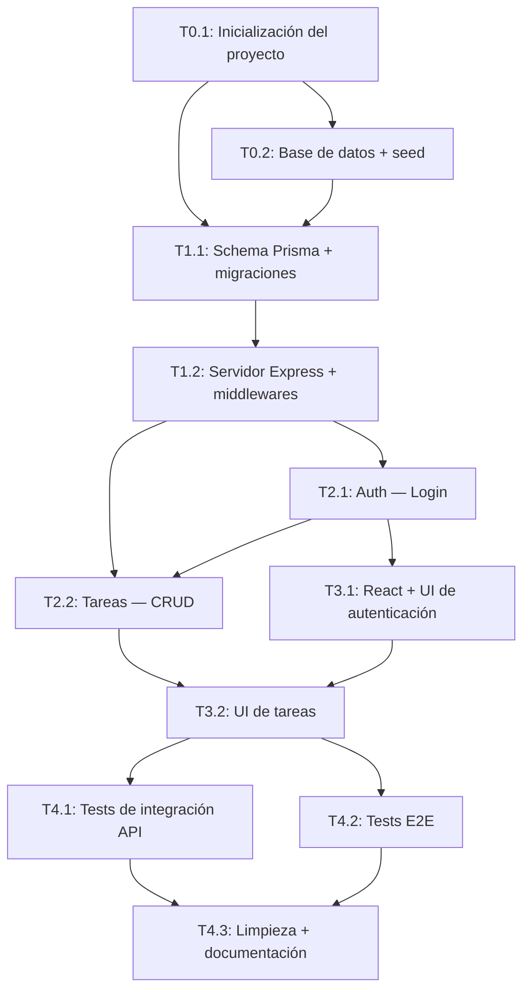

# Tasks: Task Manager Core

> 📋 Generated by `implementer` · 2026-07-08
> ✅ Approved by: jsolano (2026-07-08)

## Traceability
- **Work Item**: [AB#104568](https://dev.azure.com/unipagosa/SDD_SANDBOX/_workitems/edit/104568)
- **Parent**: [AB#104567](https://dev.azure.com/unipagosa/SDD_SANDBOX/_workitems/edit/104567)
- **Branch**: `feature/AB#104567-task-manager-core`

## Metadata
- **Based on:** [design.md](./design.md)
- **Total estimate:** ~28h (incluye 20% buffer)
- **Number of waves:** 4
- **Number of tasks:** 12
- **Sprint:** [TBD]
- **Assignee:** [TBD]

## Estimation Rules

Ver `estimation-strategy.md` para reglas completas, multiplicadores AI e impacto de arquitectura.

**Referencia rápida:**
- Máximo **4 horas** por tarea (dividir si es mayor)
- Estimaciones incluyen implementación + unit tests + code review
- Si una tarea excede 4h durante implementación, dividirla inmediatamente
- **20% buffer** agregado al total para imprevistos
- Con IDEs agénticos + SDD: aplicar multiplicadores de `estimation-strategy.md` §Scenario B

## Dependency Graph

---

## Wave 0: project setup (~7h)

### Task 0.1: Inicialización del proyecto (~2h)
- **Descripción:** Inicializar monorepo con estructura fullstack: `/client` (React + Vite + TypeScript), `/server` (Express + TypeScript). Configurar linting, tsconfig, scripts de desarrollo.
- **Criterios de aceptación:**
  - [ ] `package.json` raíz con scripts para client/server
  - [ ] `/client` inicializado con Vite + React 18 + TypeScript
  - [ ] `/server` inicializado con Express 5 + TypeScript + ts-node
  - [ ] ESLint + Prettier configurados
  - [ ] `.env.example` creado con todas las variables documentadas
  - [ ] `.gitignore` actualizado (node_modules, .env, dist)
  - [ ] `npm run dev` arranca ambos servidores
  - [ ] Design system aplicado — CSS variables del theme Corporate, Google Fonts (Inter + Plus Jakarta Sans), reset y utilidades base en `client/src/index.css`
- **Dependencias:** Ninguna
- **Archivos:** `package.json`, `client/`, `server/`, `tsconfig.json`, `.eslintrc`, `.prettierrc`, `.env.example`, `.gitignore`, `client/src/index.css`

### Task 0.2: Base de datos + seed (~2h)
- **Descripción:** Docker Compose con PostgreSQL 16 Alpine. Inicializar Prisma ORM, crear seed script con usuario de prueba (bcrypt hash, cost 12).
- **Criterios de aceptación:**
  - [ ] `docker-compose.yml` con postgres:16-alpine en port 5432
  - [ ] Prisma inicializado (`prisma init`)
  - [ ] `.env` con `DATABASE_URL` apuntando a Docker
  - [ ] Seed script crea usuario `admin` con password hasheado (bcrypt cost 12)
  - [ ] `npm run db:seed` ejecuta el seed
  - [ ] `npm run db:reset` limpia y re-seedea
- **Dependencias:** Task 0.1
- **Archivos:** `docker-compose.yml`, `server/prisma/`, `server/prisma/seed.ts`, `.env`

### Task 0.3: IaC + AWS RDS provisioning (~3h)
- **Descripción:** Provisionar base de datos PostgreSQL en AWS RDS para entorno remoto (dev/cert/prod). Configurar via CDK o Terraform según preferencia. Incluir security groups, parameter groups y connection string.
- **Criterios de aceptación:**
  - [ ] Infraestructura como código para RDS PostgreSQL 16
  - [ ] Security group permite conexión solo desde Vercel/VPC
  - [ ] Parameter group con configuración optimizada
  - [ ] Outputs: endpoint, port, connection string
  - [ ] Documentación de deploy en `docs/infrastructure/`
  - [ ] `.env.production.example` con `DATABASE_URL` de RDS
  - [ ] Script o instrucciones para provisionar/destruir
- **Dependencias:** Task 0.2
- **Archivos:** `infra/`, `docs/infrastructure/rds-setup.md`, `.env.production.example`

---

## Wave 1: foundation & setup (~4h)

### Task 1.1: Schema Prisma + migraciones (~2h)
- **Descripción:** Crear schema de Prisma con modelos User y Task según design.md §Database Schema. Generar y aplicar migration inicial.
- **Criterios de aceptación:**
  - [ ] Modelo `User`: id (UUID), username (unique), passwordHash, createdAt
  - [ ] Modelo `Task`: id (UUID), title, description (optional), completed (default false), createdAt, userId (FK → User)
  - [ ] Índices: `idx_tasks_user_id`, `idx_tasks_created_at` DESC
  - [ ] Migration generada y aplicable (`npx prisma migrate dev`)
  - [ ] `npx prisma generate` genera client sin errores
- **Dependencias:** Task 0.2
- **Archivos:** `server/prisma/schema.prisma`, `server/prisma/migrations/`

### Task 1.2: Servidor Express + cadena de middlewares (~2h)
- **Descripción:** Configurar Express 5 con la cadena de middlewares definida en security-model.md: cors → helmet → rateLimit → express.json → apiKeyGate → routes. Incluir health check.
- **Criterios de aceptación:**
  - [ ] Express arranca en `PORT` de env
  - [ ] `cors()` configurado con `CORS_ORIGIN` de env
  - [ ] `helmet()` activo
  - [ ] `express.json({ limit: '10kb' })` activo
  - [ ] `rateLimit()` global: 100 req/15min
  - [ ] Middleware `apiKeyGate` valida header `x-api-key`
  - [ ] `GET /api/health` retorna `{ status: "ok", database, uptime, version }`
  - [ ] Health check verifica conexión a DB (Prisma)
- **Dependencias:** Task 0.1
- **Archivos:** `server/src/index.ts`, `server/src/middleware/apiKeyGate.ts`, `server/src/middleware/rateLimiter.ts`, `server/src/routes/health.ts`

---

## Wave 2: core implementation (~6h)

### Task 2.1: Controlador de autenticación — POST /api/auth/login (~3h)
- **Descripción:** Implementar endpoint de login según design.md §API Contracts y security-model.md §Auth Flow. Incluye validación de input, búsqueda por username, bcrypt compare, generación JWT.
- **Criterios de aceptación:**
  - [ ] `POST /api/auth/login` acepta `{ username, password }`
  - [ ] Validación: username 3-50 chars, password 6-100 chars (express-validator)
  - [ ] Busca usuario por username (Prisma)
  - [ ] Compara password con hash (`bcrypt.compare`)
  - [ ] Genera JWT con `{ userId, username }` y expiración 1h
  - [ ] Response 200: `{ token, user: { id, username } }`
  - [ ] Response 401: `{ error: "Invalid credentials" }`
  - [ ] Rate limiter específico: 5 intentos/15min en login
  - [ ] Unit tests: happy path + credenciales inválidas + input inválido
- **Dependencias:** Task 1.1, Task 1.2
- **Archivos:** `server/src/routes/auth.ts`, `server/src/controllers/authController.ts`, `server/src/middleware/authMiddleware.ts`, `server/src/validators/authValidator.ts`
- **ADO WI:** [AB#104594](https://dev.azure.com/unipagosa/SDD_SANDBOX/_workitems/edit/104594)

### Task 2.2: Controlador de tareas — CRUD completo (~3h)
- **Descripción:** Implementar 4 endpoints de tareas según design.md §API Contracts. Todos protegidos por JWT, ownership enforced en cada query.
- **Criterios de aceptación:**
  - [ ] `GET /api/tasks` — lista tareas del usuario, ordenadas por createdAt DESC
  - [ ] `POST /api/tasks` — crea tarea con `{ title, description? }`, valida título 1-255 chars
  - [ ] `PATCH /api/tasks/:id` — toggle `completed`, verifica ownership
  - [ ] `DELETE /api/tasks/:id` — elimina tarea, verifica ownership, response 204
  - [ ] Todas las queries filtran por `userId` del JWT (ownership enforcement)
  - [ ] Validación de `:id` como UUID v4
  - [ ] 404 si tarea no existe o no pertenece al usuario
  - [ ] Unit tests por endpoint: happy path + ownership + validación
- **Dependencias:** Task 2.1 (necesita authMiddleware)
- **Archivos:** `server/src/routes/tasks.ts`, `server/src/controllers/taskController.ts`, `server/src/validators/taskValidator.ts`

---

## Wave 3: UI & integration (~6h)

### Task 3.1: React setup + UI de autenticación (~3h)
- **Descripción:** Configurar React con AuthContext, apiClient (axios), y página de Login. Redirigir a lista de tareas tras login exitoso.
- **Criterios de aceptación:**
  - [ ] `AuthContext` con state: `{ token, user, isAuthenticated }`
  - [ ] `apiClient` (axios) con interceptor que agrega `x-api-key` y `Authorization: Bearer`
  - [ ] `LoginPage` con formulario username/password
  - [ ] Manejo de error: muestra mensaje si credenciales inválidas
  - [ ] Token almacenado en `localStorage` (MVP)
  - [ ] Redirect a `/tasks` tras login exitoso
  - [ ] Componente `ProtectedRoute` — redirige a `/login` si no autenticado
  - [ ] Logout: limpia token + redirige a login
  - [ ] Responsive (320px–1920px) — NFR-002
- **Dependencias:** Task 2.1
- **Archivos:** `client/src/context/AuthContext.tsx`, `client/src/services/apiClient.ts`, `client/src/pages/LoginPage.tsx`, `client/src/components/ProtectedRoute.tsx`

### Task 3.2: UI de lista de tareas + CRUD (~3h)
- **Descripción:** Página principal con lista de tareas y formulario para crear. Botones de completar/descompletar y eliminar con confirmación.
- **Criterios de aceptación:**
  - [ ] `TaskListPage` muestra todas las tareas del usuario
  - [ ] `TaskForm` con input de título + descripción opcional
  - [ ] Crear tarea: formulario se limpia tras éxito (REQ-001 AC)
  - [ ] Lista ordenada por createdAt DESC (REQ-002)
  - [ ] Cada tarea muestra título, descripción (si existe), estado
  - [ ] Botón toggle completar/descompletar (REQ-003)
  - [ ] Botón eliminar con confirmación (REQ-004)
  - [ ] Mensaje "No hay tareas registradas" cuando lista vacía (REQ-002 AC)
  - [ ] Loading state durante fetch
  - [ ] Responsive (320px–1920px) — NFR-002
  - [ ] Accesible: labels, contraste, navegación por teclado — NFR-004
- **Dependencias:** Task 2.2, Task 3.1
- **Archivos:** `client/src/pages/TaskListPage.tsx`, `client/src/components/TaskForm.tsx`, `client/src/components/TaskItem.tsx`

---

## Wave 4: testing & polish (~4h)

### Task 4.1: Tests de integración API (~2h)
- **Descripción:** Tests de integración para todos los endpoints contra DB real (Docker). Cubrir happy paths, errores de auth, validación, ownership.
- **Criterios de aceptación:**
  - [ ] Setup: DB de test limpia antes de cada suite
  - [ ] Auth: login exitoso, credenciales inválidas, rate limiting
  - [ ] Tasks CRUD: crear, listar, completar, eliminar
  - [ ] Ownership: no acceder/modificar tareas de otro usuario
  - [ ] Validación: inputs inválidos retornan 400
  - [ ] API Key: requests sin key retornan 403
  - [ ] Cobertura ≥ 80% en controllers y middleware
- **Dependencias:** Task 2.1, Task 2.2
- **Archivos:** `server/tests/`, `server/tests/auth.test.ts`, `server/tests/tasks.test.ts`, `server/jest.config.ts`

### Task 4.2: Tests E2E (~1h)
- **Descripción:** Tests end-to-end del flujo completo: login → crear tarea → completar → eliminar.
- **Criterios de aceptación:**
  - [ ] Flujo completo: login → ver lista vacía → crear tarea → aparece en lista → completar → eliminar
  - [ ] Usa `data-testid` para selectors
  - [ ] Pasa en modo headless (listo para CI)
- **Dependencias:** Task 3.2
- **Archivos:** `client/tests/e2e/`, `playwright.config.ts`

### Task 4.3: Limpieza + documentación (~1h)
- **Descripción:** Limpiar código, actualizar README, verificar que no queden TODOs ni dead code.
- **Criterios de aceptación:**
  - [ ] README.md con: setup, ejecución, tests, deploy
  - [ ] Sin `TODO`/`FIXME` en código
  - [ ] Sin imports sin usar ni dead code
  - [ ] ESLint + Prettier sin warnings
  - [ ] `.env.example` completo y documentado
- **Dependencias:** Todas las anteriores
- **Archivos:** `README.md`, limpieza general

---

## Implementation Order Summary

| Orden | Tarea | Descripción | Est. | Depende de |
|-------|-------|-------------|------|------------|
| 1 | 0.1 | Inicialización del proyecto + design system | ~2h | — |
| 2 | 0.2 | Base de datos local + seed | ~2h | 0.1 |
| 3 | 0.3 | IaC + AWS RDS provisioning | ~3h | 0.2 |
| 4 | 1.1 | Schema Prisma + migraciones | ~2h | 0.2 |
| 5 | 1.2 | Servidor Express + middlewares | ~2h | 0.1 |
| 6 | 2.1 | Controlador de autenticación (login) | ~3h | 1.1, 1.2 |
| 7 | 2.2 | Controlador de tareas (CRUD) | ~3h | 2.1 |
| 8 | 3.1 | React + UI de autenticación | ~3h | 2.1 |
| 9 | 3.2 | UI de lista de tareas | ~3h | 2.2, 3.1 |
| 10 | 4.1 | Tests de integración API (QA) | ~2h | 2.1, 2.2 |
| 11 | 4.2 | Tests E2E (QA) | ~1h | 3.2 |
| 12 | 4.3 | Limpieza + documentación | ~1h | Todas |

## Total estimate: ~28h (includes 20% buffer)

**Estimado base:** 23h · **Buffer (20%):** 5h · **Total:** 28h

## Completion Checklist
- [ ] Todas las tareas completadas
- [ ] Todos los tests pasando (unit + integración + E2E)
- [ ] Cobertura ≥ 80% statements, ≥ 70% branches
- [ ] Código revisado
- [ ] README actualizado
- [ ] Sin warnings críticos de lint
- [ ] ESLint + Prettier limpios
- [ ] Todos los REQs cubiertos (REQ-001 a REQ-005)
- [ ] Todos los NFRs verificados (NFR-001 a NFR-006)

---
> 📍 [AB#104568](https://dev.azure.com/unipagosa/SDD_SANDBOX/_workitems/edit/104568) · 🌿 `feature/AB#104567-task-manager-core` · Generated by SDD Standard
