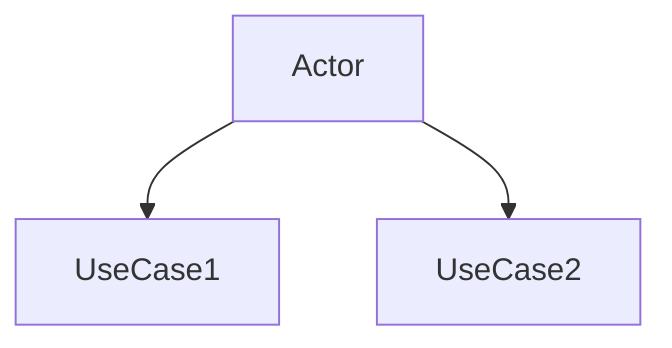
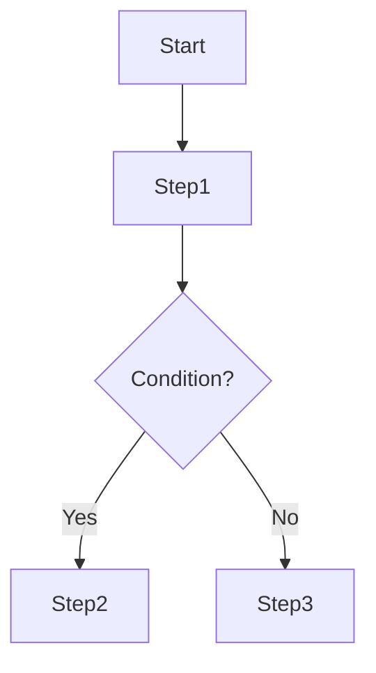
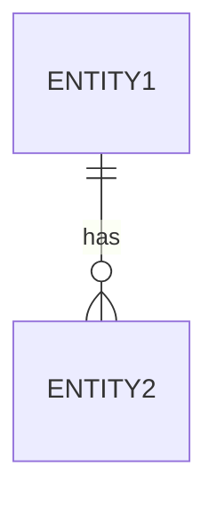

# Requirements: [Feature Name]

> 📋 Generated by `[power-name]` · [YYYY-MM-DD]
> ✅ Approved by: [pending]

## Trazabilidad
<!-- Work Item = Requirement WI (HIJO). Parent = Feature/Epic (PADRE). NUNCA invertir. -->
- **Work Item**: [{prefix}{ID}]({tracker_url})
- **Parent**: [{parent_prefix}{parent_ID}]({parent_tracker_url})
- **Rama**: [tipo]/{prefix}[ID]-[nombre]
- **Design**: [design.md](./design.md)
- **Test Plan**: [test-plan.md](./test-plan.md)

## Overview
[Brief description of the feature]

## User Stories (EARS Notation)

### REQ-001: [Title]
**Type:** [Ubiquitous|Event-Driven|State-Driven|Unwanted|Optional]

The system SHALL [behavior]
[WHEN|WHILE|IF|WHERE] [condition] (if applicable)

**Acceptance Criteria:**
- [ ] [Criterion 1]
- [ ] [Criterion 2]

**Priority:** [Must|Should|Could]
**Tracker:** {prefix}[ID]

## Diagrams

### Use Case Diagram

### User Flow

### Conceptual ER

## Dependencies
<!-- Cross-feature dependencies. Remove section if none. -->
| Feature | Capability needed | Status | Workaround |
|---------|------------------|--------|------------|
| <!-- feature --> | <!-- capability --> | <!-- ✅ Existe / ⬜ No existe --> | <!-- stub or — --> |

## Supuestos
<!-- Assumptions and temporary stubs. Remove section if none. -->
| # | Supuesto | Stub temporal | Se reemplaza cuando |
|---|----------|---------------|---------------------|
| <!-- A1 --> | <!-- assumption --> | <!-- stub --> | <!-- when replaced --> |

## Approval
- [ ] Analista: _____ Fecha: _____

---
> 📍 [{prefix}{ID}]({tracker_url}) · 🌿 `feature/{prefix}{ID}-name` · Generated by SDD Standard
