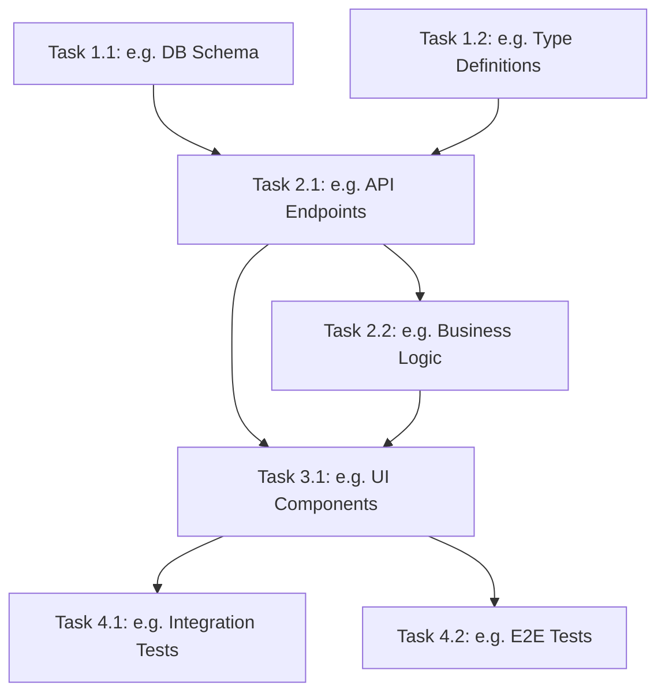

# Tasks: [Feature Name]

> 📋 Generated by `[power-name]` · [YYYY-MM-DD]
> ✅ Approved by: [pending]

<!--
  TEMPLATE USAGE GUIDE:
  - Sections marked "ALWAYS" must appear in every tasks document.
  - Sections marked "CONDITIONAL" should be included only if applicable.
  - Content inside sections is EXEMPLARY — analyze the actual design.md and generate
    contextual tasks. Do NOT copy placeholder items verbatim.
  - Items in [brackets] are placeholders to be replaced with real data.
  - Items after "e.g.:" are examples — generate project-specific items instead.
  - Wave 0 is ONLY for greenfield projects. Skip entirely if project has infrastructure.
  - Tasks within waves are EXAMPLES of the kind of work — generate actual tasks from design.md.
-->

## Traceability
<!-- ALWAYS. Work Item = Requirement WI (CHILD). Parent = Feature/Epic (PARENT). Never invert. -->
- **Work Item**: [{prefix}{ID}]({tracker_url})
- **Branch**: feature/{prefix}{ID}-[name]

## Metadata
<!-- ALWAYS -->
- **Based on:** [link to design.md]
- **Total estimate:** ~[hours]h
- **Number of waves:** [N]
- **Number of tasks:** [N]
- **Sprint:** [TBD — read from ADO or ask user. NEVER fabricate a sprint number]
- **Assignee:** [TBD — ask user. NEVER auto-assign]

## Estimation Rules
<!-- ALWAYS -->

See `estimation-strategy.md` for full estimation rules, AI multipliers, and architecture impact.

**Quick reference:**
- Maximum **4 hours** per task (break larger tasks into subtasks)
- Estimates include implementation + unit tests + code review
- If a task exceeds 4h during implementation, split it immediately
- Add **20% buffer** to total estimate for unknowns
- If using agentic IDEs + SDD: apply multipliers from `estimation-strategy.md` §Scenario B
- Track actual vs estimated for future calibration (see `estimation-strategy.md` §Calibration)

## Dependency Graph
<!-- ALWAYS. Generate from actual task breakdown — this is an EXAMPLE structure. -->

*Update this diagram to reflect actual task dependencies. Use underscores in node IDs (T1_1), NOT dots (T1.1) — dots break Mermaid rendering.*

---

## Wave 0: Project Setup (~[hours]h)
<!-- CONDITIONAL: Include ONLY if the repo is greenfield (no package.json, no DB, no framework). Skip if project already has infrastructure. -->
<!-- Generate tasks from actual project needs. The tasks below are EXAMPLES of common setup tasks — include only what applies. -->

### Task 0.1: [Project initialization] (~[hours]h)
<!-- CONDITIONAL: Include if no project scaffold exists. -->
- **Description:** [Describe actual project initialization needs]
<!-- e.g.: Initialize project structure (package.json / pyproject.toml / pubspec.yaml), install core dependencies, configure linter, create .env template -->
- **Acceptance criteria:**
  - [ ] [project-specific criterion]
  <!-- e.g.: Package manager initialized with project metadata -->
  <!-- e.g.: Core dependencies installed (framework, ORM, test runner) -->
  <!-- e.g.: Linter/formatter configured -->
  <!-- e.g.: .env.example created with required vars documented -->
- **Dependencies:** None
- **Files to create/modify:** [list actual files]

### Task 0.2: [Database setup + seed] (~[hours]h)
<!-- CONDITIONAL: Include if project uses a database. -->
- **Description:** [Describe actual DB setup needs]. DB strategy follows this hierarchy:
  1. **Docker** (primary) → `docker-compose.yml` with DB container matching production engine
  2. **Local native** → if DB already installed on dev machine
  3. **Cloud dev DB** → if project is cloud-native and dev has CLI configured (AWS RDS, Azure SQL)
  4. **SQLite** (last resort) → ⚠️ ONLY if nothing above is available. NOT transparent — mark as temporary.
  - Scope depends on whether Task 0.3 (IaC) is included:
    - **If IaC included (Task 0.3 exists):** Only initialize ORM, create `.env` template, configure connection to IaC-provisioned DB. Do NOT provision DB manually — Task 0.3 handles that.
    - **If IaC NOT included:** Full DB setup per hierarchy above + ORM init + `.env`.
  - **Seed script:** Always include a seed script using faker (`@faker-js/faker` for JS/TS, `faker` pip for Python) with deterministic seed (`42`). Minimum 25 records per table. This enables both Dev and QA to have realistic test data from day 1.
- **Acceptance criteria:**
  - [ ] [project-specific criterion]
  <!-- e.g.: ORM initialized (e.g. `prisma init`, `typeorm init`) -->
  <!-- e.g.: `.env` with `DATABASE_URL` (pointing to local or IaC-provisioned DB) -->
  <!-- e.g.: `.env.example` documenting required DB vars -->
  <!-- e.g.: `.gitignore` updated for DB artifacts and env files -->
  <!-- e.g.: Dev DB accessible and running (method: [docker / local / cloud / sqlite-temp]) -->
  <!-- e.g.: If SQLite fallback: tasks.md note → "DB: SQLite (temporal) — migrate to [production engine] before CERT" -->
  <!-- e.g.: Seed script created with faker + deterministic seed -->
  <!-- e.g.: Seed runnable via single command -->
- **Dependencies:** Task 0.1
- **Files to create/modify:** [list actual files]

### Task 0.3: [Infrastructure as Code] (~[hours]h) — *OPTIONAL, ask user*
<!-- CONDITIONAL: Include if project uses cloud DB or user wants IaC from day 1. If user defers → move to last wave. -->
*⚠️ CANNOT be deferred if QA tests against cloud DB (preview/staging environments). Without IaC, QA has no database for PR previews → QA blocked from Wave 1 onward. In that case, Task 0.3 is MANDATORY in Wave 0.*
- **Description:** [Describe actual IaC needs]. Use the IaC tool matching the cloud provider (CDK for AWS, Bicep for Azure, Terraform for multi-cloud).
- **Acceptance criteria:**
  - [ ] [project-specific criterion]
  <!-- e.g.: IaC project initialized (e.g. `cdk init`, `terraform init`) -->
  <!-- e.g.: Dev environment stack defined (DB instance, security group, env vars) -->
  <!-- e.g.: Stack deployable with single command -->
  <!-- e.g.: Connection string output wired to app's .env -->
- **Dependencies:** Task 0.2
- **Files to create/modify:** [list actual files]

### Task 0.4: [CI/CD Pipeline] (~[hours]h) — *OPTIONAL, ask user*
<!-- CONDITIONAL: Include if team project or user wants CI from day 1. If user defers → move to last wave. -->
- **Description:** [Describe actual CI/CD needs]. Use the platform matching the project's hosting.
<!-- e.g.: GitHub Actions, Azure Pipelines, AWS CodePipeline -->
- **Acceptance criteria:**
  - [ ] [project-specific criterion]
  <!-- e.g.: Pipeline config created -->
  <!-- e.g.: Runs on push: lint + type-check + tests -->
  <!-- e.g.: Deploy step to dev environment (if IaC is set up) -->
  <!-- e.g.: Secrets/env vars configured in pipeline settings -->
- **Dependencies:** Task 0.1 (+ Task 0.3 if deploy step included)
- **Files to create/modify:** [list actual files]
- **⚠️ Mobile CI/CD** (Fastlane, Codemagic, code signing, store distribution) → **deferrable**. Can be set up in any wave after Task 0.5. Does NOT block mobile development.

### Task 0.5: [Mobile Platform Setup] (~[hours]h) — *OPTIONAL, only if mobile project*
<!-- CONDITIONAL: Include if project targets iOS/Android via Capacitor, Flutter, or React Native. -->
- **Description:** [Describe actual mobile platform setup needs].
  <!-- e.g.: Capacitor: `npx cap init`, `npx cap add android`, configure `capacitor.config.ts` -->
  <!-- e.g.: Flutter: `flutter create`, configure flavors, setup FVM -->
  <!-- e.g.: React Native: `npx react-native init`, configure Metro, setup build variants -->
- **Acceptance criteria:**
  - [ ] [project-specific criterion]
  <!-- e.g.: Native platform projects created (android/, ios/) -->
  <!-- e.g.: App builds successfully on at least one platform -->
  <!-- e.g.: App ID / Bundle ID configured correctly -->
  <!-- e.g.: .gitignore updated for native build artifacts -->
- **Dependencies:** Task 0.1
- **Files to create/modify:** [list actual files]

---

## Wave 1: Foundation & Setup (~[hours]h)
<!-- ALWAYS. Infrastructure, schemas, types — no business logic yet. -->
<!-- Generate tasks from actual design.md analysis. The tasks below are EXAMPLES of typical foundation work. -->

### Task 1.1: [task name from design] (~[hours]h)
<!-- e.g.: Database schema / data model -->
- **Description:** [What to build — from design.md]
- **Acceptance criteria:**
  - [ ] [Specific, testable criterion from design.md]
  - [ ] [Specific, testable criterion from design.md]
  <!-- e.g.: Migration created and tested (up + down) -->
- **Dependencies:** None
- **Files to create/modify:** [list files]

### Task 1.2: [task name from design] (~[hours]h)
<!-- e.g.: Type definitions / interfaces -->
- **Description:** [What to build — from design.md]
- **Acceptance criteria:**
  - [ ] [Specific, testable criterion from design.md]
  - [ ] [Specific, testable criterion from design.md]
  <!-- e.g.: Types exported from feature barrel -->
- **Dependencies:** None
- **Files to create/modify:** [list files]

### Task 1.3: [task name from design] (~[hours]h)
<!-- e.g.: Configuration / environment setup -->
- **Description:** [What to build — from design.md]
- **Acceptance criteria:**
  - [ ] [Specific, testable criterion from design.md]
  <!-- e.g.: Environment variables documented -->
- **Dependencies:** None
- **Files to create/modify:** [list files]

<!-- Add/remove tasks based on actual design.md scope. These 3 tasks are exemplary. -->

---

## Wave 2: Core Implementation (~[hours]h)
<!-- ALWAYS. Business logic, API endpoints, core services — depends on Wave 1. -->
<!-- Generate tasks from actual design.md. The tasks below are EXAMPLES of typical core work. -->

### Task 2.1: [task name from design] (~[hours]h)
<!-- e.g.: API endpoints / routes -->
- **Description:** [What to build — from design.md]
- **Acceptance criteria:**
  - [ ] [Specific, testable criterion from design.md]
  <!-- e.g.: [Endpoint] returns correct response for valid input -->
  <!-- e.g.: Input validation with schema -->
  <!-- e.g.: Authorization checks in place -->
  <!-- e.g.: Unit tests written (≥ 80% coverage) -->
- **Dependencies:** [list actual dependencies]
- **Files to create/modify:** [list files]

### Task 2.2: [task name from design] (~[hours]h)
<!-- e.g.: Business logic / service layer -->
- **Description:** [What to build — from design.md]
- **Acceptance criteria:**
  - [ ] [Specific, testable criterion from design.md]
  <!-- e.g.: [Business rule] correctly implemented -->
  <!-- e.g.: Edge cases handled: [list edge cases] -->
  <!-- e.g.: Unit tests for happy path + error cases -->
- **Dependencies:** [list actual dependencies]
- **Files to create/modify:** [list files]

### Task 2.3: [task name from design] (~[hours]h)
<!-- e.g.: Data access / repository layer -->
- **Description:** [What to build — from design.md]
- **Acceptance criteria:**
  - [ ] [Specific, testable criterion from design.md]
  <!-- e.g.: CRUD operations working -->
  <!-- e.g.: Queries optimized (indexes, eager loading) -->
  <!-- e.g.: Transaction handling where needed -->
- **Dependencies:** [list actual dependencies]
- **Files to create/modify:** [list files]

<!-- Add/remove tasks based on actual design.md scope. These 3 tasks are exemplary. -->

---

## Wave 3: UI & Integration (~[hours]h)
<!-- CONDITIONAL: Include if project has a UI layer. Omit for backend-only or library projects. -->
<!-- Generate tasks from actual design.md. The tasks below are EXAMPLES of typical UI work. -->

### Task 3.1: [task name from design] (~[hours]h)
<!-- e.g.: UI components -->
- **Description:** [What to build — from design.md]
- **Acceptance criteria:**
  - [ ] [Specific, testable criterion from design.md]
  <!-- e.g.: Component renders correctly with all prop variants -->
  <!-- e.g.: Keyboard navigation works -->
  <!-- e.g.: Accessible (axe-core passes) -->
  <!-- e.g.: Responsive (mobile + desktop) -->
- **Dependencies:** [list actual dependencies]
- **Files to create/modify:** [list files]

### Task 3.2: [task name from design] (~[hours]h)
<!-- e.g.: Page integration / routing -->
- **Description:** [What to build — from design.md]
- **Acceptance criteria:**
  - [ ] [Specific, testable criterion from design.md]
  <!-- e.g.: Page renders with data from API -->
  <!-- e.g.: Loading and error states handled -->
  <!-- e.g.: Route navigation works -->
  <!-- e.g.: Protected route (auth check) -->
- **Dependencies:** [list actual dependencies]
- **Files to create/modify:** [list files]

<!-- Add/remove tasks based on actual design.md scope. These 2 tasks are exemplary. -->

---

## Wave 4: Testing & Polish (~[hours]h)
<!-- ALWAYS. Integration tests, E2E tests, polish — depends on previous waves. -->
<!-- Generate tasks from actual test strategy. The tasks below are EXAMPLES. -->

### Task 4.1: [task name from design] (~[hours]h)
<!-- e.g.: Integration tests -->
- **Description:** [What to test — from design.md]
- **Acceptance criteria:**
  - [ ] [Specific, testable criterion from design.md]
  <!-- e.g.: API integration tests cover all endpoints -->
  <!-- e.g.: Database integration tests with test data -->
  <!-- e.g.: Error scenarios tested -->
- **Dependencies:** [list actual dependencies]
- **Files to create/modify:** [list files]

### Task 4.2: [task name from design] (~[hours]h)
<!-- e.g.: E2E tests -->
- **Description:** [What to test — from design.md]
- **Acceptance criteria:**
  - [ ] [Specific, testable criterion from design.md]
  <!-- e.g.: Critical user flow covered end-to-end -->
  <!-- e.g.: Uses `data-testid` selectors -->
  <!-- e.g.: Passes on CI (headless) -->
- **Dependencies:** [list actual dependencies]
- **Files to create/modify:** [list files]

### Task 4.3: [task name from design] (~[hours]h)
<!-- e.g.: Documentation & cleanup -->
- **Description:** [What to document — from design.md]
- **Acceptance criteria:**
  - [ ] [Specific, testable criterion from design.md]
  <!-- e.g.: README updated with feature documentation -->
  <!-- e.g.: API endpoints documented (OpenAPI/Swagger) -->
  <!-- e.g.: No TODO/FIXME left in code -->
  <!-- e.g.: No unused imports or dead code -->
- **Dependencies:** All previous tasks
- **Files to create/modify:** [list files]

<!-- Add/remove tasks based on actual design.md scope. These 3 tasks are exemplary. -->

---

## Implementation Order Summary
<!-- ALWAYS. Generate from actual task breakdown — this table is an EXAMPLE structure. -->
| Order | Task   | Description                | Est.  | Depends On    |
|-------|--------|----------------------------|-------|---------------|
<!-- Generate from actual tasks. Example rows: -->
<!-- e.g.: | 1 | 1.1 | [DB Schema] | ~Xh | — | -->
<!-- e.g.: | 2 | 1.2 | [Type Definitions] | ~Xh | — | -->
<!-- e.g.: | 3 | 2.1 | [API Endpoints] | ~Xh | 1.1, 1.2 | -->

## Total Estimate: ~[hours]h (includes 20% buffer)

## Completion Checklist
<!-- ALWAYS. Generate project-specific items — these are EXAMPLES. -->
- [ ] All tasks completed
- [ ] All tests passing
<!-- e.g.: Coverage targets met (80% statements, 70% branches) -->
<!-- e.g.: Code reviewed -->
<!-- e.g.: Documentation updated -->
<!-- e.g.: No critical/high lint warnings -->
<!-- e.g.: Feature demo to stakeholder -->
- [ ] [project-specific completion criterion]

---
> 📍 [{prefix}{ID}]({tracker_url}) · 🌿 `feature/{prefix}{ID}-name` · Generated by SDD Standard
