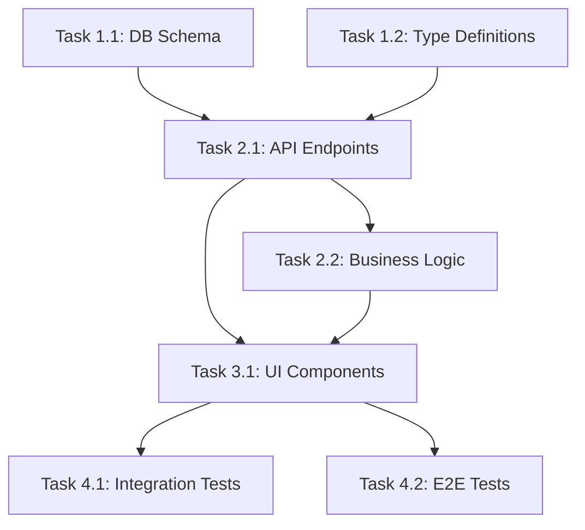

# Tasks: [Feature Name]

> 📋 Generated by `[power-name]` · [YYYY-MM-DD]
> ✅ Approved by: [pending]

## Trazabilidad
- **Work Item**: [{prefix}{ID}]({tracker_url})
- **Rama**: feature/{prefix}{ID}-[nombre]

## Metadata
- **Based on:** [link to design.md]
- **Total estimate:** ~[hours]h
- **Number of waves:** [N]
- **Number of tasks:** [N]
- **Sprint:** [TBD — read from ADO or ask user. NEVER fabricate a sprint number]
- **Assignee:** [TBD — ask user. NEVER auto-assign]

## Estimation Rules
- Maximum **4 hours** per task (break larger tasks into subtasks)
- Estimates include implementation + unit tests + code review
- If a task exceeds 4h during implementation, split it immediately
- Add **20% buffer** to total estimate for unknowns
- Track actual vs estimated for future calibration

## Dependency Graph

*Update this diagram to reflect actual task dependencies. Use underscores in node IDs (T1_1), NOT dots (T1.1) — dots break Mermaid rendering.*

---

## Wave 0: Project Setup (~[hours]h)
*Include this wave ONLY if the repo is greenfield (no package.json, no DB, no framework). Skip if project already has infrastructure.*

### Task 0.1: [Project initialization] (~[hours]h)
- **Description:** Initialize project structure (package.json / pyproject.toml / pubspec.yaml), install core dependencies, configure TypeScript/linter, create .env template
- **Acceptance criteria:**
  - [ ] Package manager initialized with project metadata
  - [ ] Core dependencies installed (framework, ORM, test runner)
  - [ ] TypeScript/linter configured (if applicable)
  - [ ] .env.example created with required vars documented
- **Dependencies:** None
- **Files to create/modify:** [package.json, tsconfig.json, .env.example, etc.]

### Task 0.2: [Database setup + seed] (~[hours]h)
- **Description:** Configure development database and seed script. DB strategy follows this hierarchy:
  1. **Docker** (primary) → `docker-compose.yml` with DB container matching production engine
  2. **Local native** → if DB already installed on dev machine
  3. **Cloud dev DB** → if project is cloud-native and dev has CLI configured (AWS RDS, Azure SQL)
  4. **SQLite** (last resort) → ⚠️ ONLY if nothing above is available. NOT transparent — mark as temporary.
  - Scope depends on whether Task 0.3 (IaC) is included:
    - **If IaC included (Task 0.3 exists):** Only initialize ORM, create `.env` template, configure connection to IaC-provisioned DB. Do NOT provision DB manually — Task 0.3 handles that.
    - **If IaC NOT included:** Full DB setup per hierarchy above + ORM init + `.env`.
  - **Seed script:** Always include a seed script using faker (`@faker-js/faker` for JS/TS, `faker` pip for Python) with deterministic seed (`42`). Minimum 25 records per table. This enables both Dev and QA to have realistic test data from day 1.
- **Acceptance criteria:**
  - [ ] ORM initialized (e.g. `prisma init`, `typeorm init`)
  - [ ] `.env` with `DATABASE_URL` (pointing to local or IaC-provisioned DB)
  - [ ] `.env.example` documenting required DB vars
  - [ ] `.gitignore` updated for DB artifacts and env files
  - [ ] If no IaC: Dev DB accessible and running (method: [docker / local / cloud / sqlite-temp])
  - [ ] If SQLite fallback: tasks.md note → "DB: SQLite (temporal) — migrate to [production engine] before CERT"
  - [ ] Seed script created (e.g. `prisma/seed.ts`, `scripts/seed.py`) with faker + deterministic seed
  - [ ] Seed runnable via single command (`npx prisma db seed`, `python scripts/seed.py`)
- **Dependencies:** Task 0.1
- **Files to create/modify:** [.env, .env.example, .gitignore, docker-compose.yml (if Docker, no IaC), prisma/schema.prisma, prisma/seed.ts]

### Task 0.3: [Infrastructure as Code] (~[hours]h) — *OPTIONAL, ask user*
*Include if: project uses cloud DB (AWS RDS, Azure SQL) or user wants IaC from day 1. If user defers → move to last wave.*
*⚠️ CANNOT be deferred if QA tests against cloud DB (preview/staging environments). Without IaC, QA has no database for PR previews → QA blocked from Wave 1 onward. In that case, Task 0.3 is MANDATORY in Wave 0.*
- **Description:** Set up infrastructure-as-code for the project's cloud resources (DB, networking, IAM). Use the IaC tool matching the cloud provider (CDK for AWS, Bicep for Azure, Terraform for multi-cloud).
- **Acceptance criteria:**
  - [ ] IaC project initialized (e.g. `cdk init`, `terraform init`)
  - [ ] Dev environment stack defined (DB instance, security group, env vars)
  - [ ] Stack deployable with single command (`cdk deploy`, `terraform apply`)
  - [ ] Connection string output wired to app's .env
- **Dependencies:** Task 0.2
- **Files to create/modify:** [infra/, cdk.json or main.tf, bin/, lib/]

### Task 0.4: [CI/CD Pipeline] (~[hours]h) — *OPTIONAL, ask user*
*Include if: team project or user wants CI from day 1. If user defers → move to last wave.*
- **Description:** Configure CI/CD pipeline for automated testing and deployment. Use the platform matching the project's hosting (GitHub Actions, Azure Pipelines, AWS CodePipeline).
- **Acceptance criteria:**
  - [ ] Pipeline config created (e.g. `.github/workflows/ci.yml`)
  - [ ] Runs on push: lint + type-check + tests
  - [ ] Deploy step to dev environment (if IaC is set up)
  - [ ] Secrets/env vars configured in pipeline settings
- **Dependencies:** Task 0.1 (+ Task 0.3 if deploy step included)
- **Files to create/modify:** [.github/workflows/ or azure-pipelines.yml]
- **⚠️ Mobile CI/CD** (Fastlane, Codemagic, code signing, store distribution) → **deferrable**. Can be set up in any wave after Task 0.5. Does NOT block mobile development.

### Task 0.5: [Mobile Platform Setup] (~[hours]h) — *OPTIONAL, only if mobile project*
*Include if: project targets iOS/Android via Capacitor, Flutter, or React Native.*
- **Description:** Initialize native mobile platform scaffolding and configure build targets.
  - **Capacitor**: `npx cap init`, `npx cap add android`, `npx cap add ios`, configure `capacitor.config.ts` with server URL and plugins.
  - **Flutter**: `flutter create`, configure flavors (dev/staging/prod), setup FVM for version management, configure `build.gradle` / `Podfile`.
  - **React Native**: `npx react-native init`, configure Metro, setup Gradle/Xcode build variants.
- **Acceptance criteria:**
  - [ ] Native platform projects created (android/, ios/)
  - [ ] App builds successfully on at least one platform (emulator/simulator)
  - [ ] App ID / Bundle ID configured correctly
  - [ ] *(Capacitor)* `capacitor.config.ts` configured with correct `appId`, `appName`, `webDir`
  - [ ] *(Flutter)* FVM configured with pinned Flutter version, flavors defined
  - [ ] *(Flutter)* `pubspec.yaml` with core dependencies, `analysis_options.yaml` configured
  - [ ] Native splash screen and app icon placeholders set
  - [ ] `.gitignore` updated for native build artifacts
- **Dependencies:** Task 0.1
- **Files to create/modify:** [capacitor.config.ts, android/, ios/, pubspec.yaml (Flutter), .fvmrc (Flutter)]

---

## Wave 1: Foundation & Setup (~[hours]h)
Infrastructure, schemas, types — no business logic yet.

### Task 1.1: [Database schema / data model] (~[hours]h)
- **Description:** [What to build]
- **Acceptance criteria:**
  - [ ] [Specific, testable criterion]
  - [ ] [Specific, testable criterion]
  - [ ] Migration created and tested (up + down)
- **Dependencies:** None
- **Files to create/modify:** [list files]

### Task 1.2: [Type definitions / interfaces] (~[hours]h)
- **Description:** [What to build]
- **Acceptance criteria:**
  - [ ] [Specific, testable criterion]
  - [ ] [Specific, testable criterion]
  - [ ] Types exported from feature barrel
- **Dependencies:** None
- **Files to create/modify:** [list files]

### Task 1.3: [Configuration / environment setup] (~[hours]h)
- **Description:** [What to build]
- **Acceptance criteria:**
  - [ ] [Specific, testable criterion]
  - [ ] Environment variables documented
- **Dependencies:** None
- **Files to create/modify:** [list files]

---

## Wave 2: Core Implementation (~[hours]h)
Business logic, API endpoints, core services — depends on Wave 1.

### Task 2.1: [API endpoints / routes] (~[hours]h)
- **Description:** [What to build]
- **Acceptance criteria:**
  - [ ] [Endpoint] returns correct response for valid input
  - [ ] [Endpoint] returns appropriate error for invalid input
  - [ ] Input validation with schema
  - [ ] Authorization checks in place
  - [ ] Unit tests written (≥ 80% coverage)
- **Dependencies:** Task 1.1, Task 1.2
- **Files to create/modify:** [list files]

### Task 2.2: [Business logic / service layer] (~[hours]h)
- **Description:** [What to build]
- **Acceptance criteria:**
  - [ ] [Business rule] correctly implemented
  - [ ] Edge cases handled: [list edge cases]
  - [ ] Unit tests for happy path + error cases
- **Dependencies:** Task 1.1
- **Files to create/modify:** [list files]

### Task 2.3: [Data access / repository layer] (~[hours]h)
- **Description:** [What to build]
- **Acceptance criteria:**
  - [ ] CRUD operations working
  - [ ] Queries optimized (indexes, eager loading)
  - [ ] Transaction handling where needed
- **Dependencies:** Task 1.1
- **Files to create/modify:** [list files]

---

## Wave 3: UI & Integration (~[hours]h)
Frontend components, page integration — depends on Wave 2.

### Task 3.1: [UI components] (~[hours]h)
- **Description:** [What to build]
- **Acceptance criteria:**
  - [ ] Component renders correctly with all prop variants
  - [ ] Keyboard navigation works
  - [ ] Accessible (axe-core passes)
  - [ ] Responsive (mobile + desktop)
  - [ ] Unit tests for component logic
- **Dependencies:** Task 2.1
- **Files to create/modify:** [list files]

### Task 3.2: [Page integration / routing] (~[hours]h)
- **Description:** [What to build]
- **Acceptance criteria:**
  - [ ] Page renders with data from API
  - [ ] Loading and error states handled
  - [ ] Route navigation works
  - [ ] Protected route (auth check)
- **Dependencies:** Task 2.1, Task 3.1
- **Files to create/modify:** [list files]

---

## Wave 4: Testing & Polish (~[hours]h)
Integration tests, E2E tests, polish — depends on Wave 3.

### Task 4.1: [Integration tests] (~[hours]h)
- **Description:** [What to test]
- **Acceptance criteria:**
  - [ ] API integration tests cover all endpoints
  - [ ] Database integration tests with test data
  - [ ] Error scenarios tested
- **Dependencies:** Task 2.1, Task 2.2
- **Files to create/modify:** [list files]

### Task 4.2: [E2E tests] (~[hours]h)
- **Description:** [What to test]
- **Acceptance criteria:**
  - [ ] Critical user flow covered end-to-end
  - [ ] Uses `data-testid` selectors
  - [ ] Passes on CI (headless)
- **Dependencies:** Task 3.1, Task 3.2
- **Files to create/modify:** [list files]

### Task 4.3: [Documentation & cleanup] (~[hours]h)
- **Description:** [What to document]
- **Acceptance criteria:**
  - [ ] README updated with feature documentation
  - [ ] API endpoints documented (OpenAPI/Swagger)
  - [ ] No TODO/FIXME left in code
  - [ ] No unused imports or dead code
- **Dependencies:** All previous tasks
- **Files to create/modify:** [list files]

---

## Implementation Order Summary
| Order | Task   | Description                | Est.  | Depends On    |
|-------|--------|----------------------------|-------|---------------|
| 1     | 1.1    | [DB Schema]                | ~Xh   | —             |
| 2     | 1.2    | [Type Definitions]         | ~Xh   | —             |
| 3     | 1.3    | [Config/Setup]             | ~Xh   | —             |
| 4     | 2.1    | [API Endpoints]            | ~Xh   | 1.1, 1.2      |
| 5     | 2.2    | [Business Logic]           | ~Xh   | 1.1           |
| 6     | 2.3    | [Data Access]              | ~Xh   | 1.1           |
| 7     | 3.1    | [UI Components]            | ~Xh   | 2.1           |
| 8     | 3.2    | [Page Integration]         | ~Xh   | 2.1, 3.1      |
| 9     | 4.1    | [Integration Tests]        | ~Xh   | 2.1, 2.2      |
| 10    | 4.2    | [E2E Tests]                | ~Xh   | 3.1, 3.2      |
| 11    | 4.3    | [Documentation]            | ~Xh   | All           |

## Total Estimate: ~[hours]h (includes 20% buffer)

## Completion Checklist
- [ ] All tasks completed
- [ ] All tests passing
- [ ] Coverage targets met (80% statements, 70% branches)
- [ ] Code reviewed
- [ ] Documentation updated
- [ ] No critical/high lint warnings
- [ ] Feature demo to stakeholder

---
> 📍 [{prefix}{ID}]({tracker_url}) · 🌿 `feature/{prefix}{ID}-name` · Generated by SDD Standard
